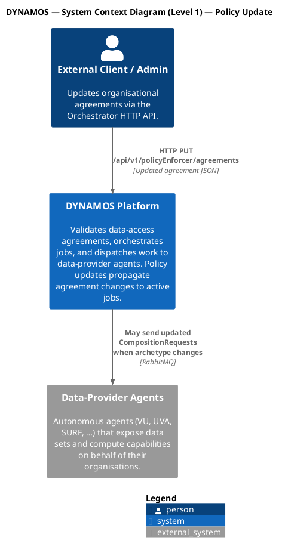
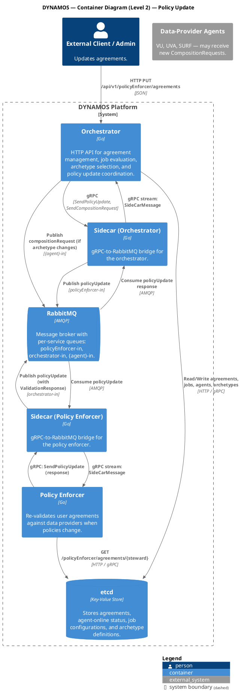
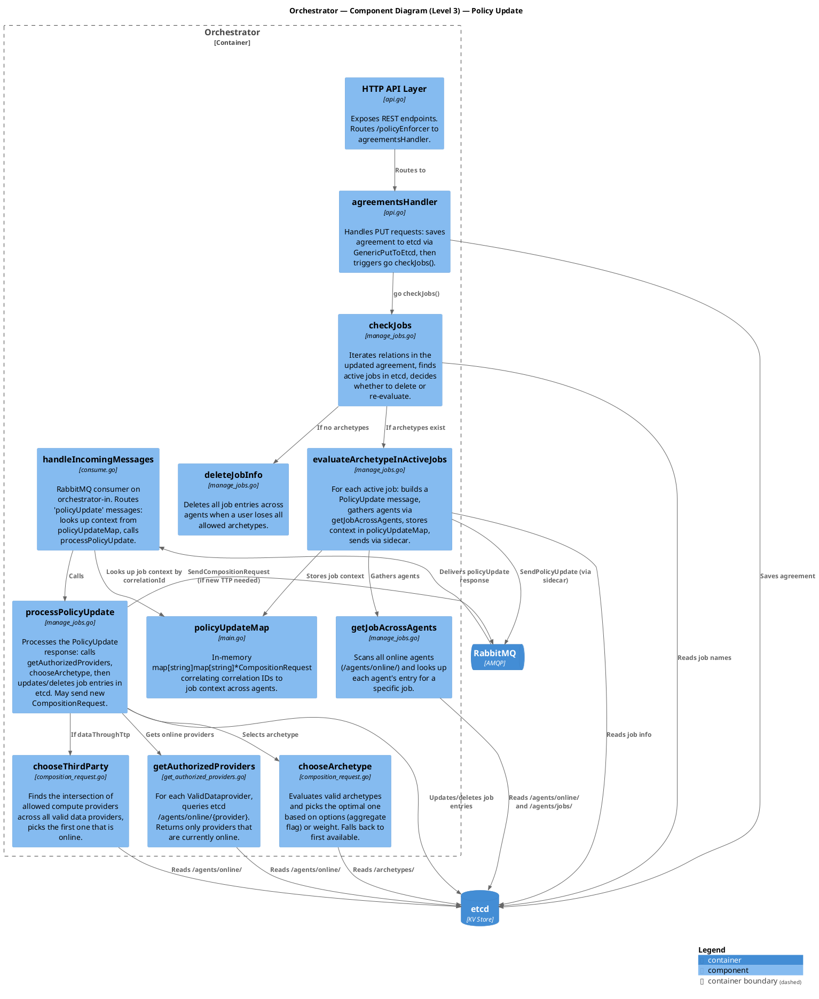
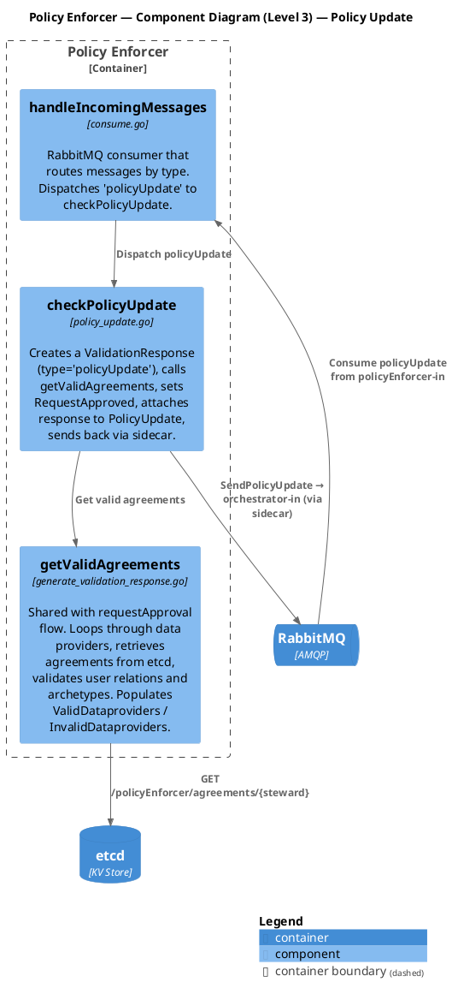
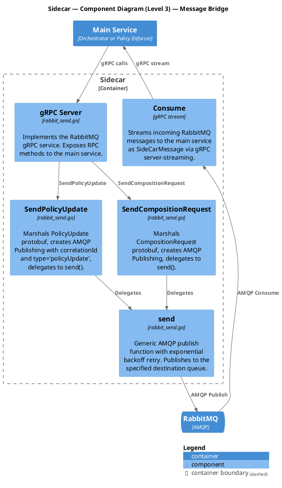
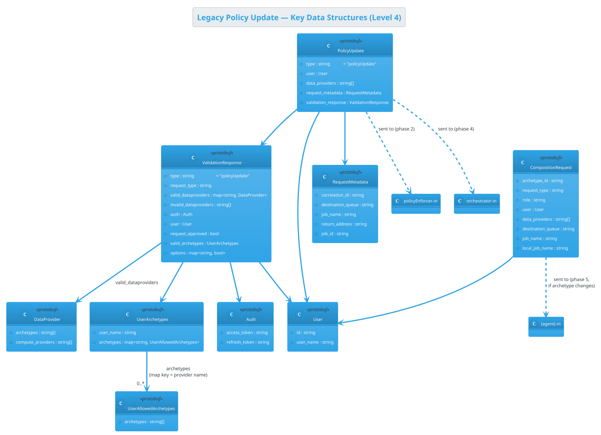
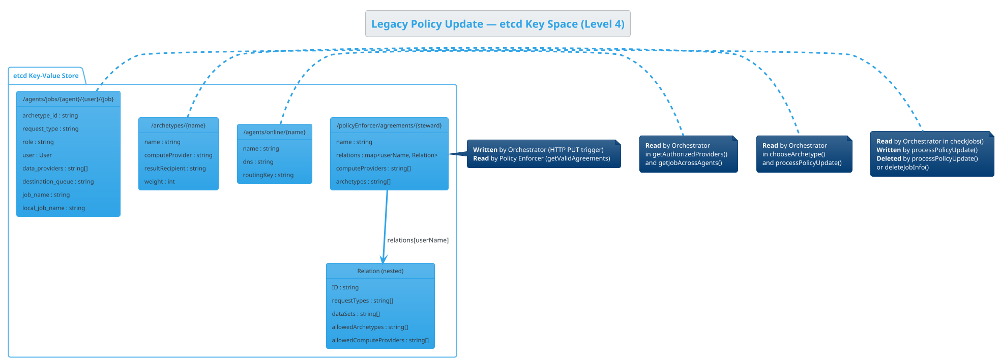
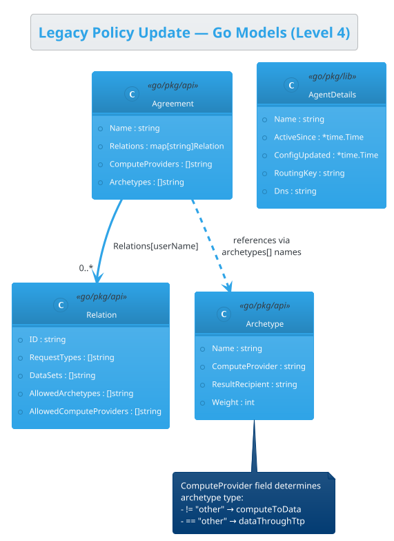

# C4 Diagrams — Legacy Policy Update Flow

This document describes the legacy DYNAMOS Policy Update flow using the
[C4 model](https://c4model.com/) (System Context, Container, Component, Code).
Each level is embedded as a PlantUML block that uses the
[C4-PlantUML](https://github.com/plantuml-stdlib/C4-PlantUML) standard library.

> **Branch:** `legacy-policy-enforcer`
>
> See also: [Legacy Policy Update Flow](../development_guide/legacy_policy_update_flow.md)

---

## Level 1 — System Context

Shows DYNAMOS as a single system box in the context of its users and any
external systems it depends on.

---

## Level 2 — Container

Zooms into the DYNAMOS system to reveal its main runtime containers and the
technologies that connect them during the policy update flow.

---

## Level 3 — Component

Decomposes each container into its key internal components and shows how they
collaborate during the policy update flow.

### 3a — Orchestrator Components

### 3b — Policy Enforcer Components

### 3c — Sidecar Components

---

## Level 4 — Code

Shows the key data structures (protobuf messages) that flow during the
policy update and the etcd key-space that underpins the system.

### 4a — Protobuf Message Structures

### 4b — etcd Key Space

### 4c — Go Model Structures

---

## How to Render

These diagrams use the [C4-PlantUML](https://github.com/plantuml-stdlib/C4-PlantUML) standard library
which is bundled with PlantUML since version 1.2021.1. You can render them with:

- **VS Code** — install the *PlantUML* extension (`jebbs.plantuml`) and preview the fenced blocks.
- **CLI** — `java -jar plantuml.jar old_policy_update_c4.md` (PlantUML renders `plantuml` fenced blocks inside Markdown).
- **Online** — paste each block into [plantuml.com](https://www.plantuml.com/plantuml/uml).
