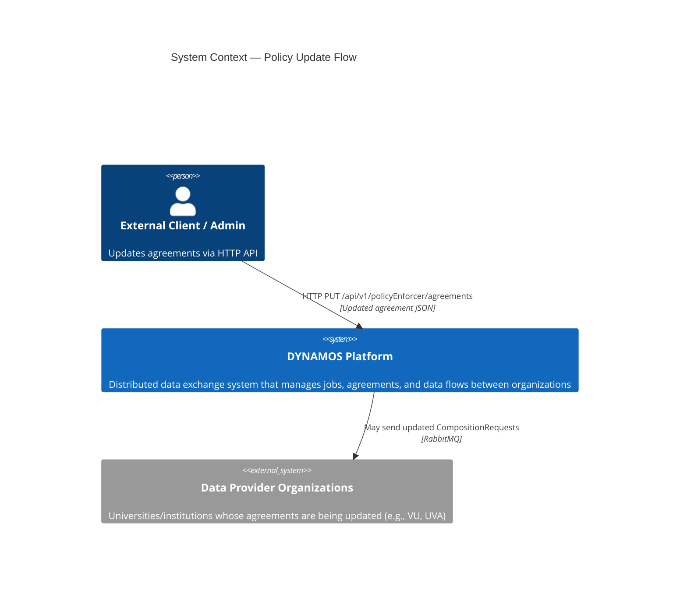
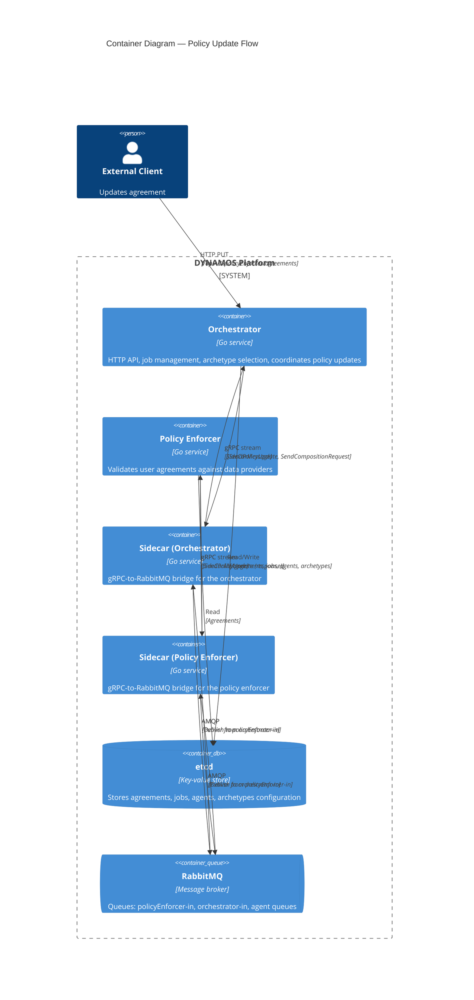
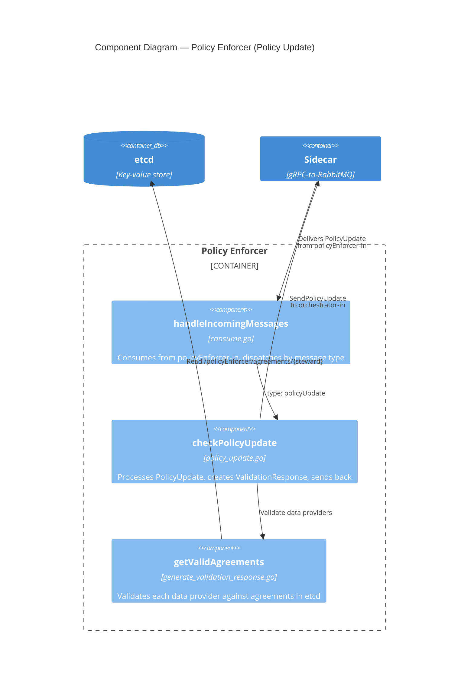
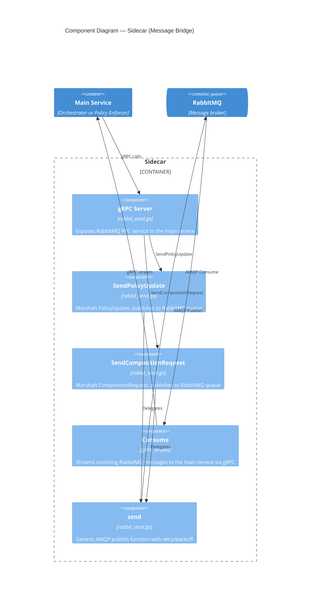
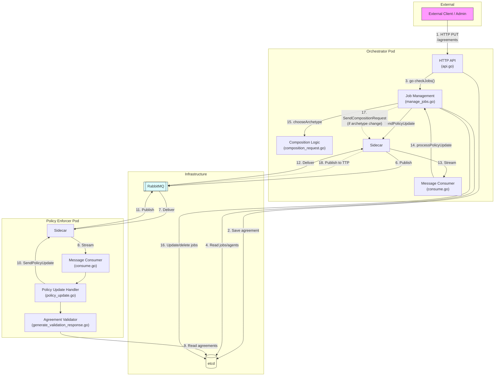

# Old/Legacy Policy Update — C4 Diagrams

> **Branch:** `legacy-policy-enforcer`
>
> These C4-style diagrams describe the **old/legacy** policy update flow at different levels of abstraction. See also: [Legacy Policy Update Flow](../development_guide/legacy_policy_update_flow.md)

## Level 1: System Context Diagram

Shows the policy update flow at the highest level — systems and actors.

## Level 2: Container Diagram

Shows the containers (services) involved and their interactions.

## Level 3: Component Diagram — Orchestrator

Shows the internal components of the orchestrator involved in the policy update flow.

```mermaid
C4Component
    title Component Diagram — Orchestrator (Policy Update)

    Container_Boundary(orchestrator, "Orchestrator") {
        Component(httpAPI, "HTTP API Layer", "api.go", "Exposes REST endpoints, routes /policyEnforcer to agreementsHandler")
        Component(agreementsHandler, "agreementsHandler", "api.go", "Handles PUT requests, saves agreement to etcd, triggers checkJobs")
        Component(checkJobs, "checkJobs", "manage_jobs.go", "Iterates relations, finds active jobs, decides if update needed")
        Component(evalArchetype, "evaluateArchetypeInActiveJobs", "manage_jobs.go", "Builds PolicyUpdate messages, gathers job context across agents")
        Component(deleteJobInfo, "deleteJobInfo", "manage_jobs.go", "Deletes job entries when user loses all archetypes")
        Component(getJobAcross, "getJobAcrossAgents", "manage_jobs.go", "Scans all online agents for entries of a specific job")
        Component(consumer, "handleIncomingMessages", "consume.go", "Consumes from orchestrator-in queue, dispatches by message type")
        Component(processPU, "processPolicyUpdate", "manage_jobs.go", "Processes PolicyUpdate response, updates job roles/archetypes")
        Component(getAuth, "getAuthorizedProviders", "get_authorized_providers.go", "Checks which valid providers are online")
        Component(chooseArch, "chooseArchetype", "composition_request.go", "Selects best archetype based on options and weights")
        Component(chooseTTP, "chooseThirdParty", "composition_request.go", "Finds common compute provider across all valid data providers")
        Component(policyUpdateMap, "policyUpdateMap", "main.go", "In-memory map correlating request IDs to job context")
    }

    ContainerDb(etcd, "etcd", "Key-value store")
    Container(sidecar, "Sidecar", "gRPC-to-RabbitMQ")

    Rel(httpAPI, agreementsHandler, "Routes to")
    Rel(agreementsHandler, etcd, "Saves agreement")
    Rel(agreementsHandler, checkJobs, "go checkJobs()")
    Rel(checkJobs, etcd, "Reads job names")
    Rel(checkJobs, deleteJobInfo, "If no archetypes")
    Rel(checkJobs, evalArchetype, "If archetypes exist")
    Rel(evalArchetype, etcd, "Reads job info")
    Rel(evalArchetype, getJobAcross, "Gathers agents")
    Rel(getJobAcross, etcd, "Reads agents/jobs")
    Rel(evalArchetype, policyUpdateMap, "Stores job context")
    Rel(evalArchetype, sidecar, "SendPolicyUpdate")

    Rel(sidecar, consumer, "Delivers response")
    Rel(consumer, policyUpdateMap, "Looks up job context")
    Rel(consumer, processPU, "Calls")
    Rel(processPU, getAuth, "Gets online providers")
    Rel(processPU, chooseArch, "Selects archetype")
    Rel(processPU, chooseTTP, "If dataThroughTtp")
    Rel(processPU, etcd, "Updates/deletes jobs")
    Rel(processPU, sidecar, "SendCompositionRequest (if new TTP needed)")
    Rel(getAuth, etcd, "Reads /agents/online/")
    Rel(chooseArch, etcd, "Reads /archetypes/")
    Rel(chooseTTP, etcd, "Reads /agents/online/")
```

## Level 3: Component Diagram — Policy Enforcer

Shows the internal components of the policy enforcer involved in the policy update flow.

## Level 3: Component Diagram — Sidecar

Shows how the sidecar bridges gRPC and RabbitMQ.

## Combined: Full System Interaction

A single diagram combining containers and their key interactions for the entire policy update lifecycle.

