# Old/Legacy Policy Update Diagrams (PlantUML)

This page embeds the Policy Update diagrams as PlantUML blocks.

Each activity and sequence section starts with a **high-level overview** that
shows only the inter-service flow, followed by **per-service detail diagrams**
that zoom into the internal logic of each microservice.

> **Branch:** `legacy-policy-enforcer`
>
> These diagrams describe the **old/legacy** policy update flow. See also: [Legacy Policy Update Flow](../development_guide/legacy_policy_update_flow.md)

---

## 1. Activity Diagrams

### 1.1 High-Level Overview

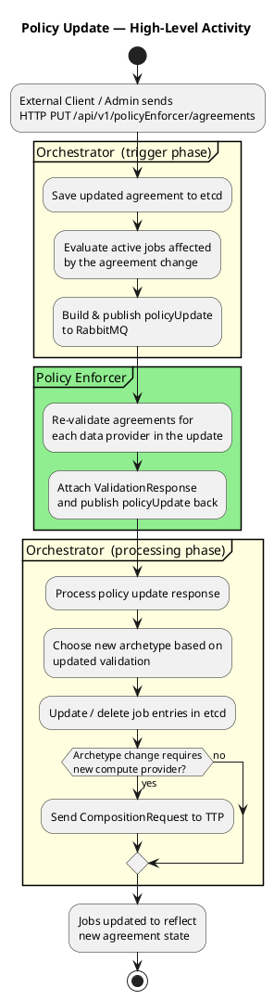

### 1.2 Orchestrator — Trigger Phase (checkJobs)

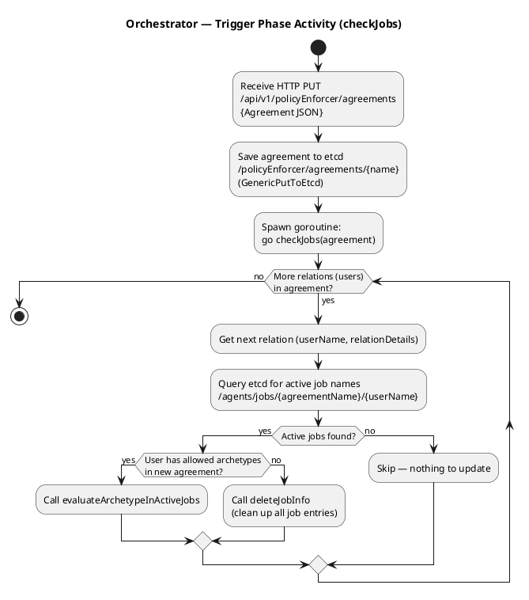

### 1.3 Orchestrator — evaluateArchetypeInActiveJobs

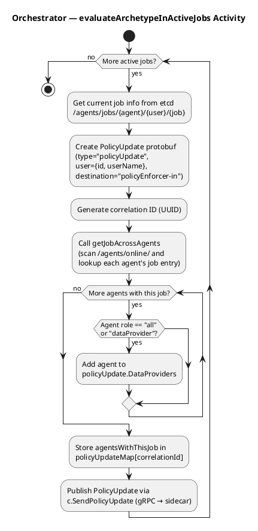

### 1.4 Policy Enforcer — checkPolicyUpdate

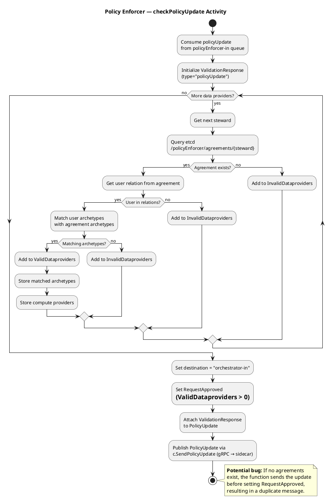

### 1.5 Orchestrator — processPolicyUpdate

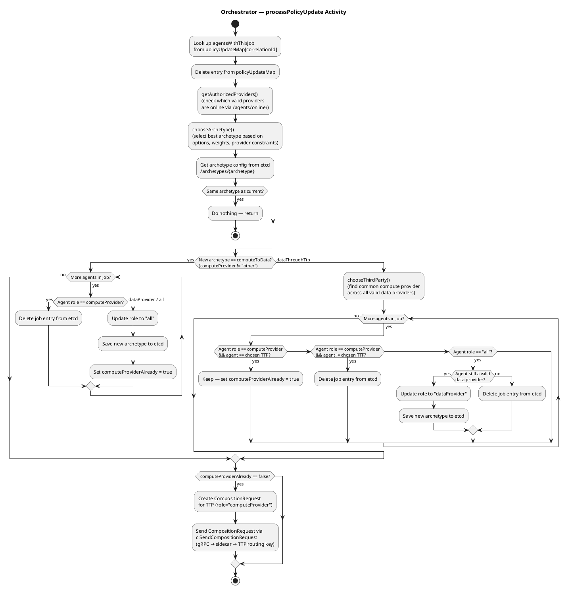

---

## 2. Sequence Diagrams

### 2.1 High-Level Overview

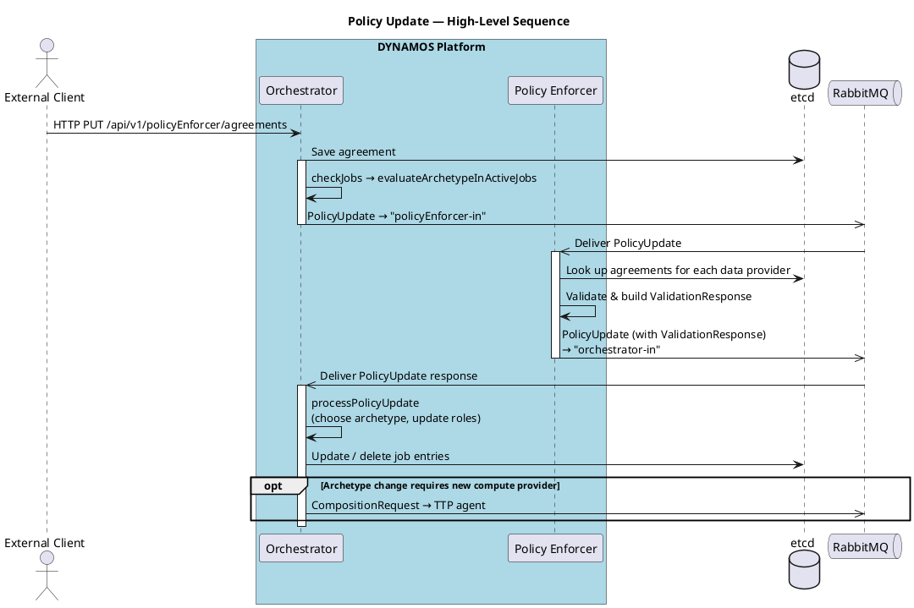

### 2.2 Full Detailed Sequence

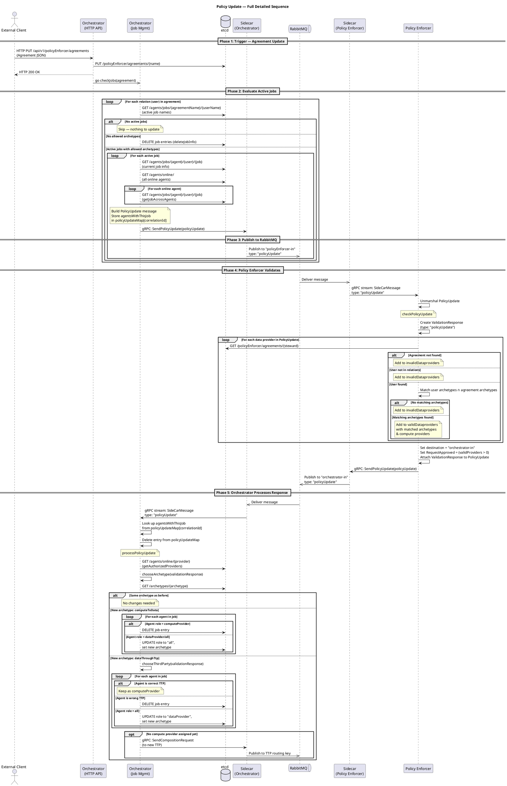

### 2.3 Orchestrator — Trigger Phase

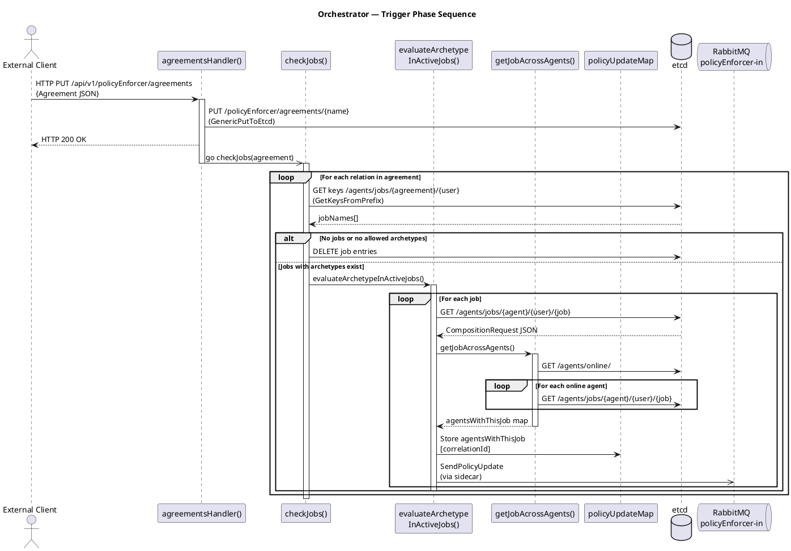

### 2.4 Policy Enforcer — checkPolicyUpdate

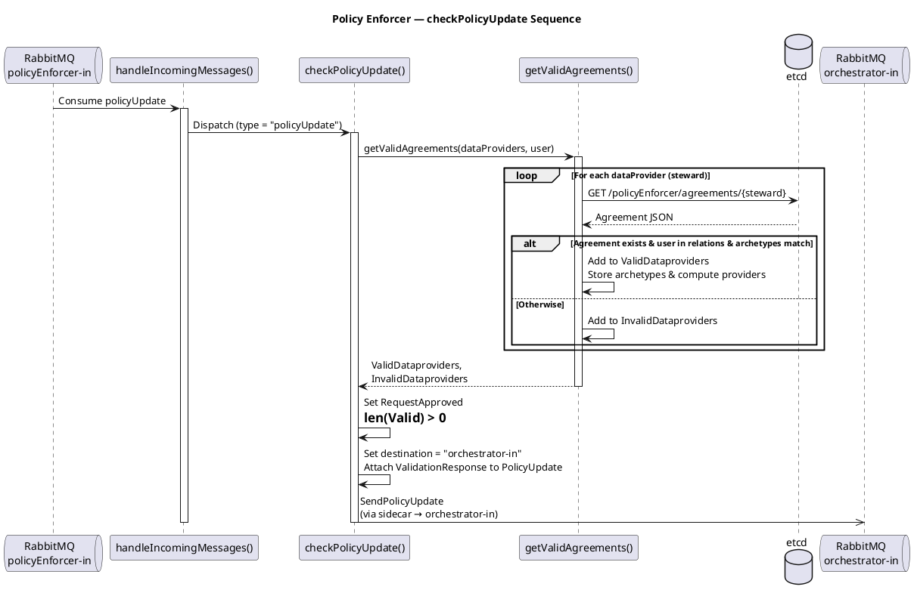

### 2.5 Orchestrator — processPolicyUpdate

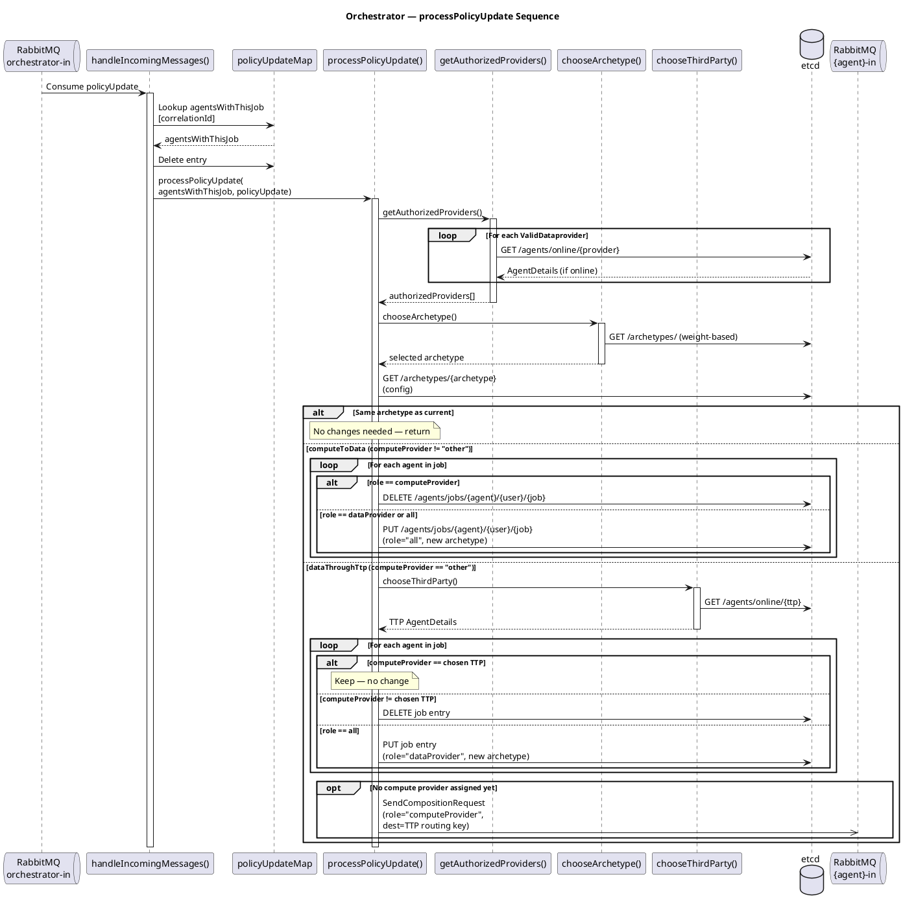

---

## 3. Architecture Diagram

A static view of the DYNAMOS components involved in the policy update flow.

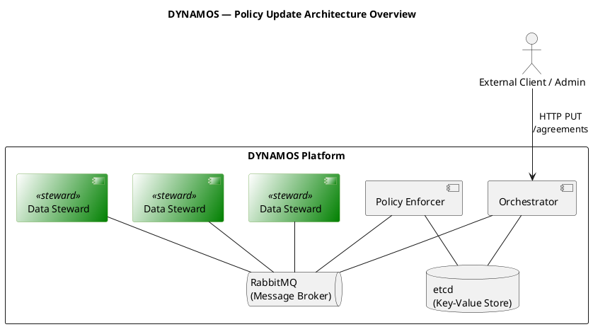

---

## 4. Component Diagram

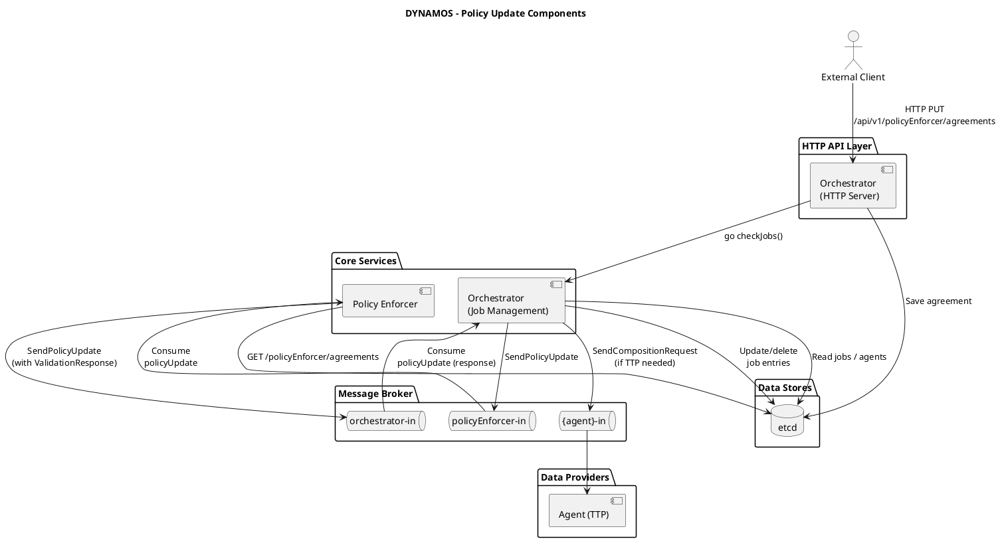

---

## 5. Message Content Diagram — PolicyUpdate Lifecycle

Shows how the `PolicyUpdate` message content evolves as it passes through the system.

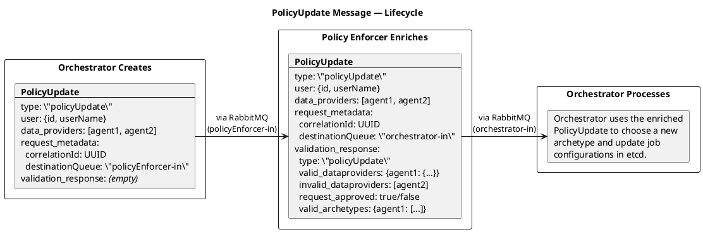

---

## 6. etcd Data Flow Diagram

Shows which etcd paths are read/written at each stage of the policy update.

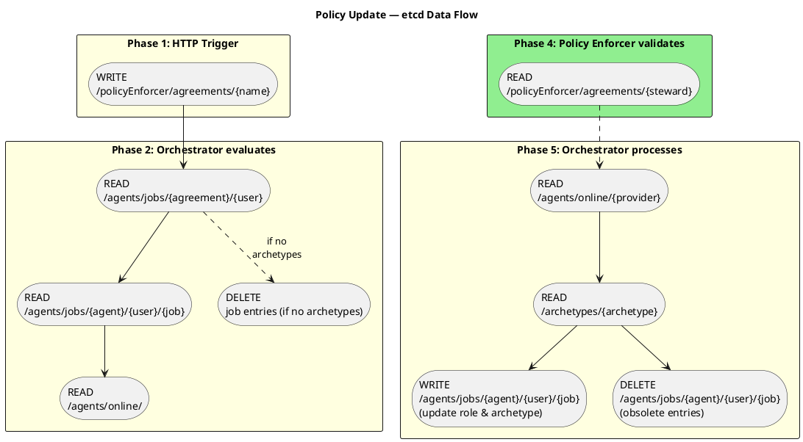
