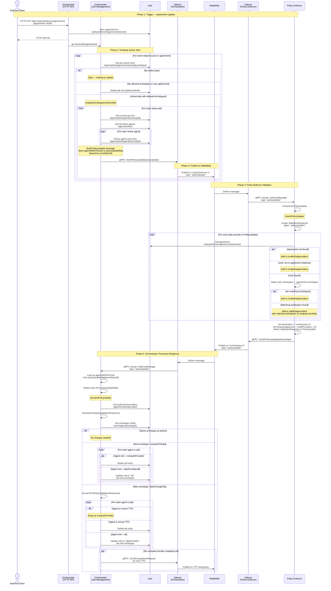
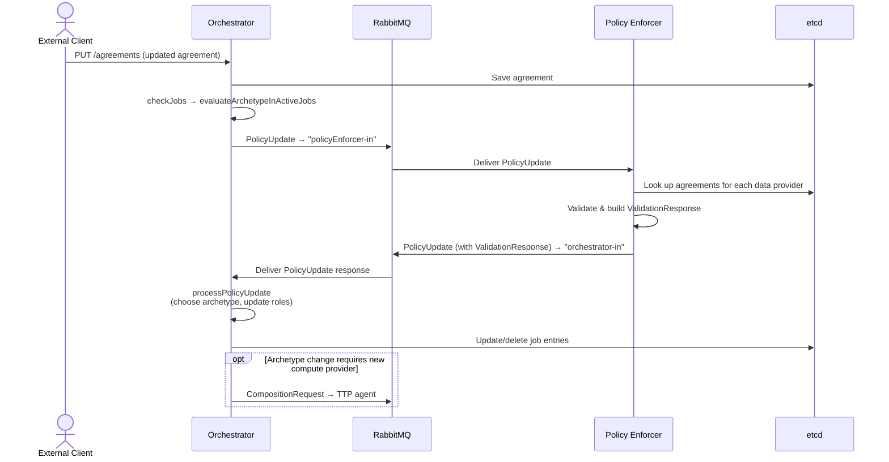
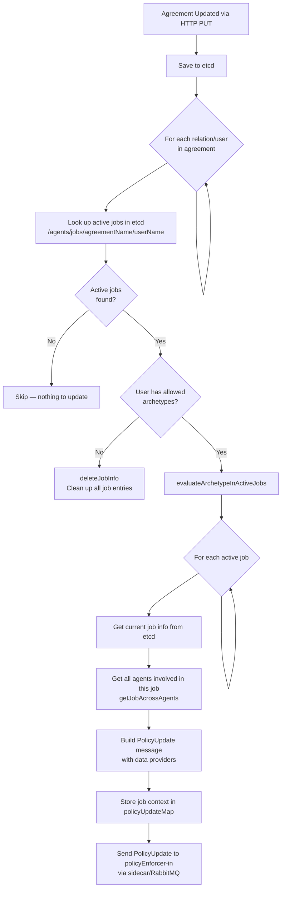
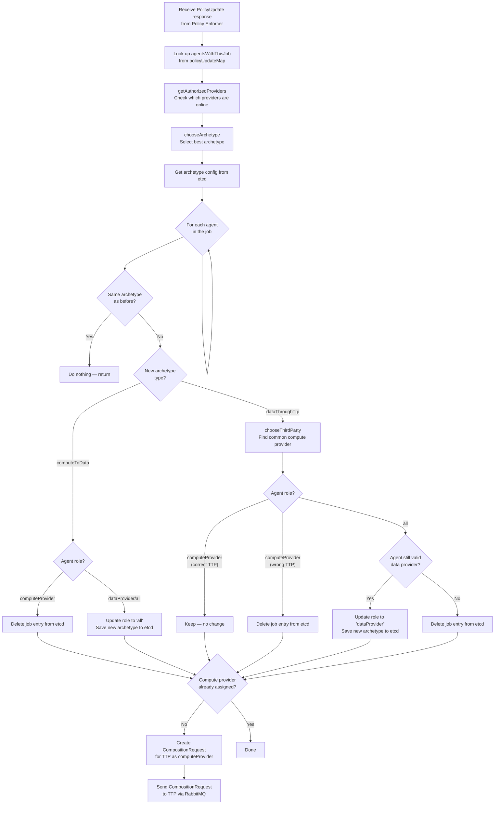
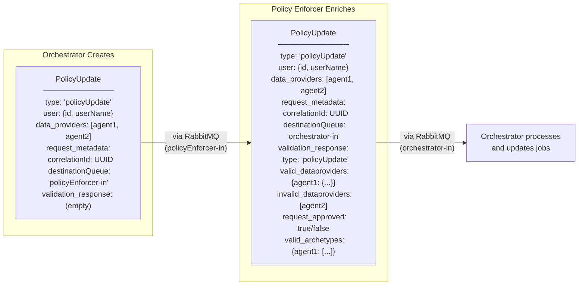
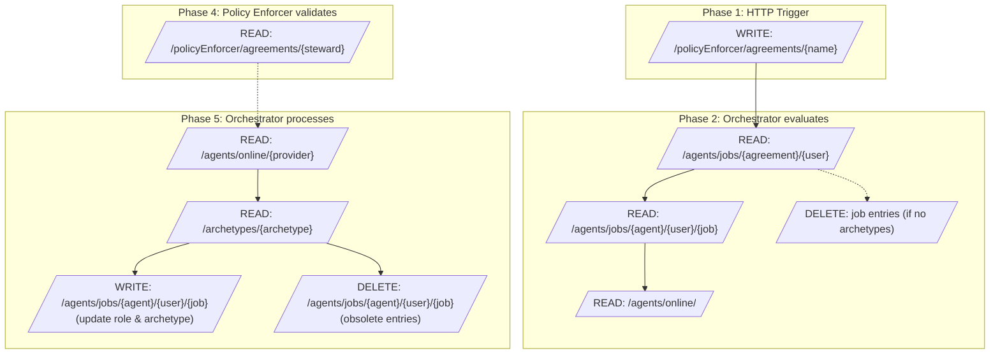

# Old/Legacy Policy Update Diagrams

> **Branch:** `legacy-policy-enforcer`
>
> These diagrams describe the **old/legacy** policy update flow. See also: [Legacy Policy Update Flow](../development_guide/legacy_policy_update_flow.md)

## 1. Full Sequence Diagram — Policy Update Flow

This diagram shows the complete message flow from when an agreement is updated via HTTP until the orchestrator finishes processing the policy update.

## 2. Simplified Overview Diagram

A high-level view focusing on the main message flow between components.

## 3. Flow Chart — checkJobs Decision Logic

## 4. Flow Chart — processPolicyUpdate Decision Logic

## 5. Message Content Diagram — PolicyUpdate Lifecycle

Shows how the `PolicyUpdate` message content evolves as it passes through the system.

## 6. etcd Data Flow Diagram

Shows which etcd paths are read/written at each stage.

