# Request Approval Diagrams (PlantUML)

This page embeds the Request Approval diagrams as PlantUML blocks.

Each activity and sequence section starts with a **high-level overview** that
shows only the inter-service flow, followed by **per-service detail diagrams**
that zoom into the internal logic of each microservice.

---

## 1. Activity Diagrams

### 1.1 High-Level Overview

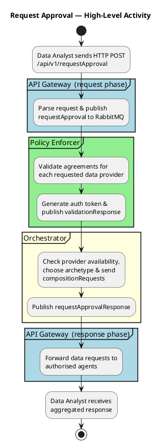

### 1.2 API Gateway — Request Phase

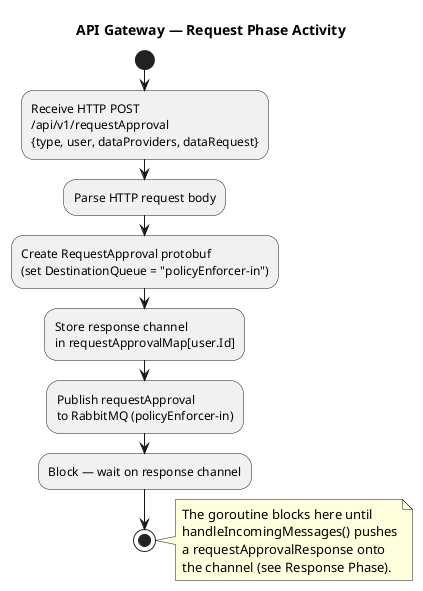

### 1.3 Policy Enforcer

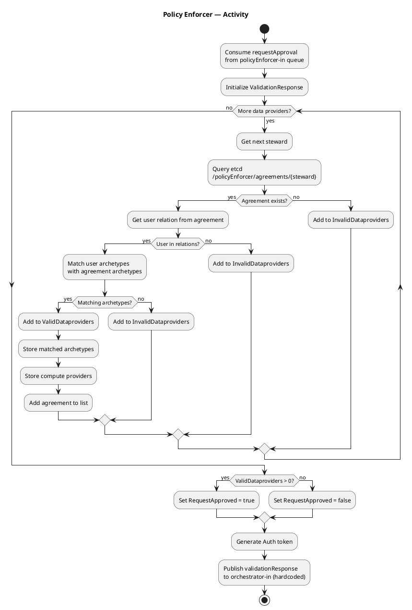

### 1.4 Orchestrator

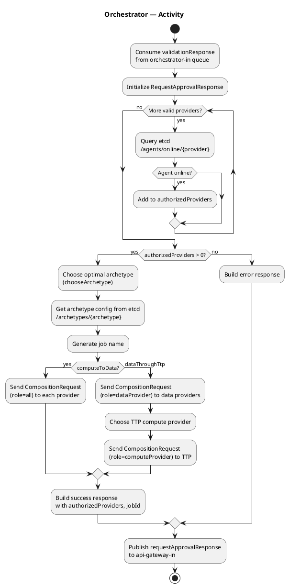

### 1.5 API Gateway — Response Phase

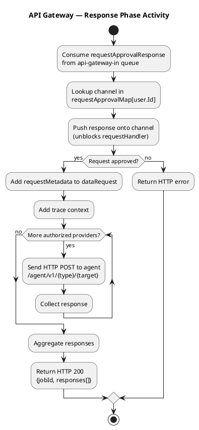

### 1.6 Agent

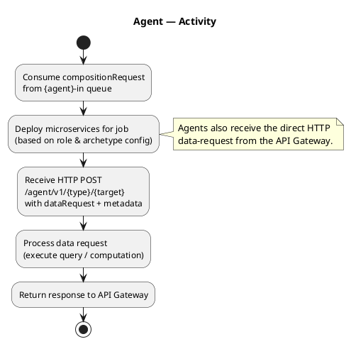

---

## 2. Sequence Diagrams

### 2.1 High-Level Overview

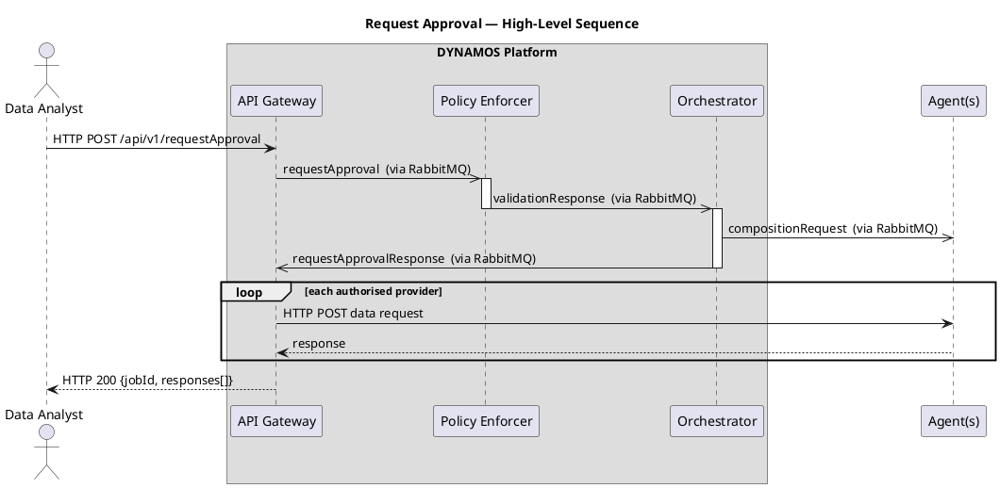

### 2.2 API Gateway — Request Phase

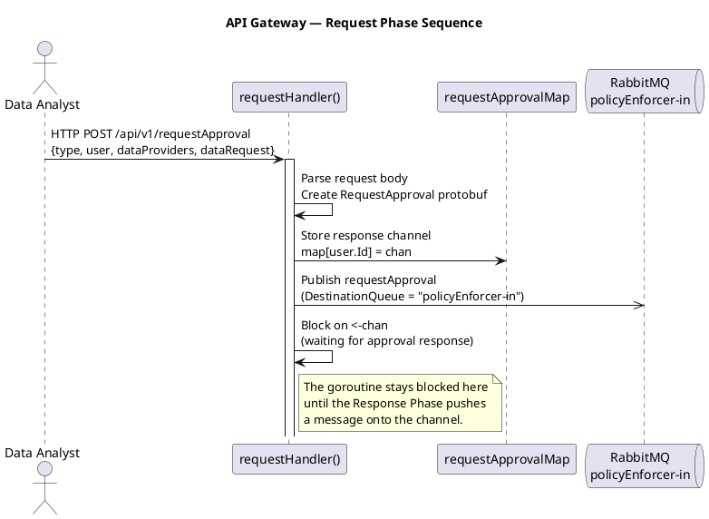

### 2.3 Policy Enforcer

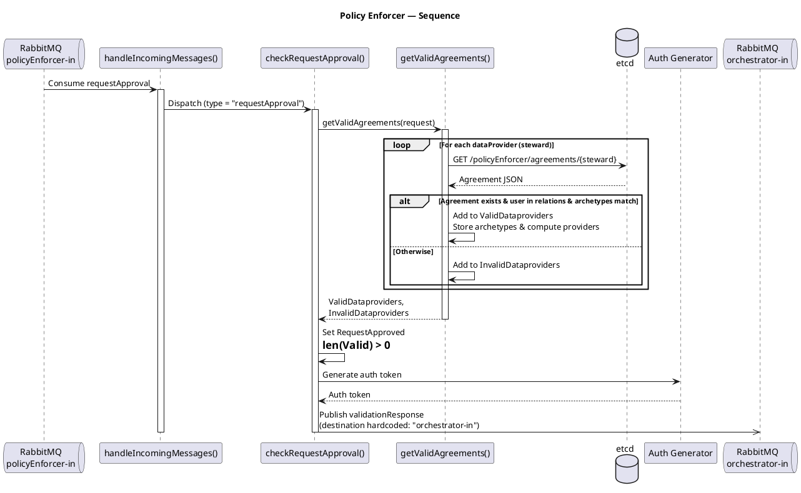

### 2.4 Orchestrator

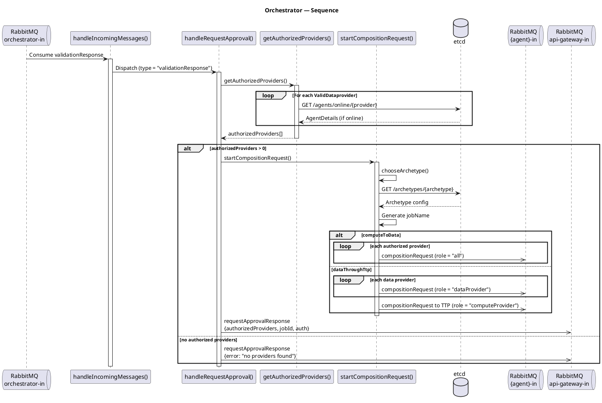

### 2.5 API Gateway — Response Phase

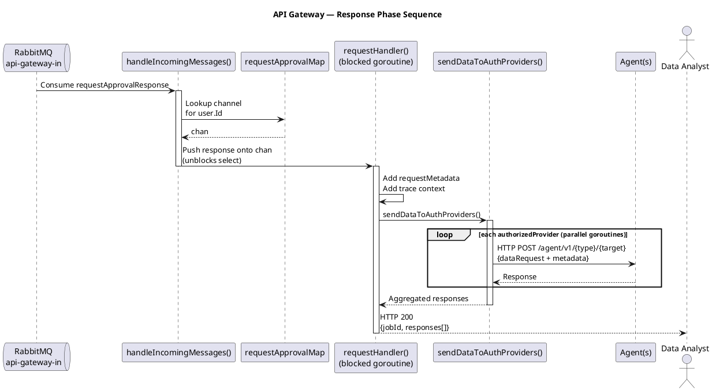

### 2.6 Agent

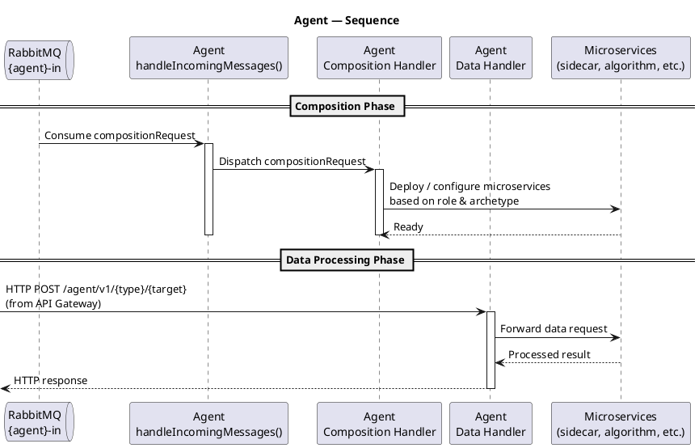

---

## 3. Architecture Diagram

A static view of how the DYNAMOS components relate to each other, without
considering any specific flow.

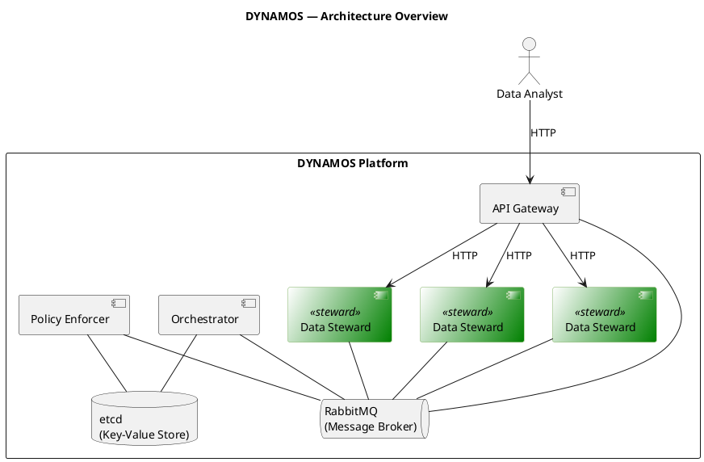

---

## 4. Component Diagram

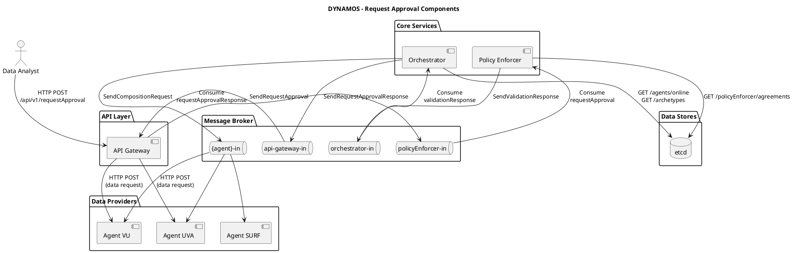
