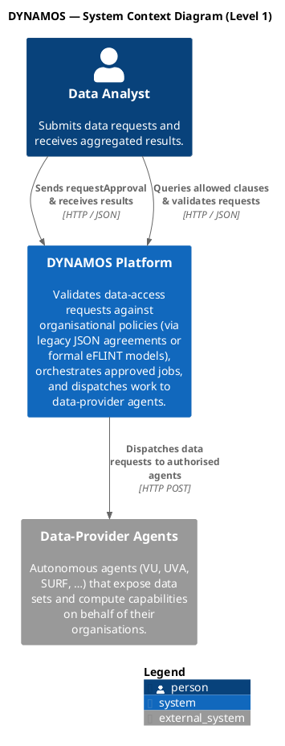
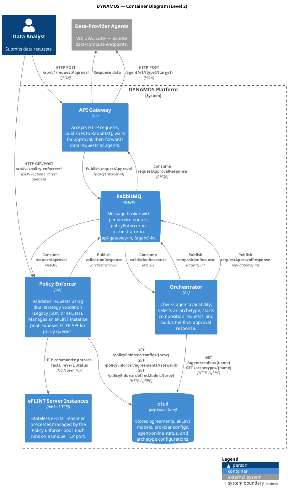
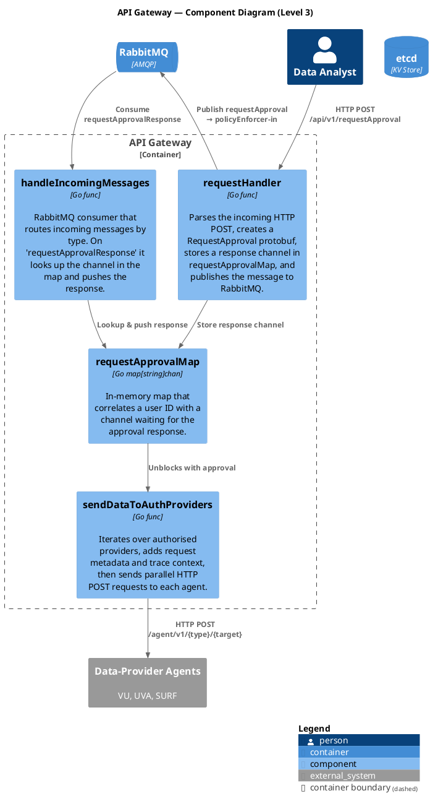
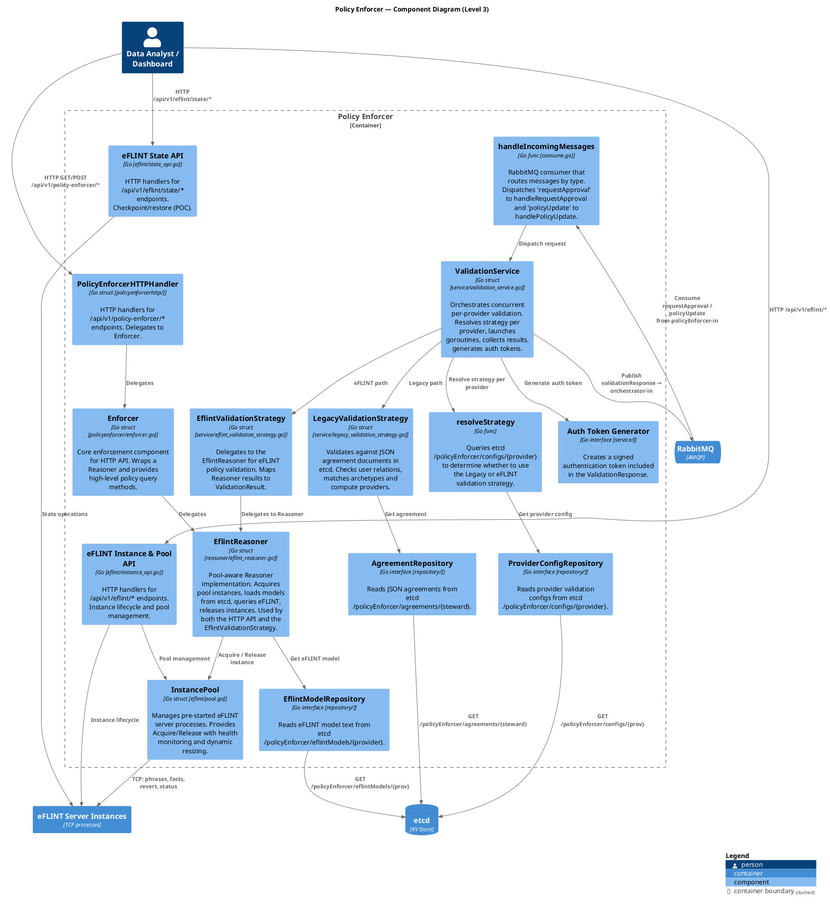
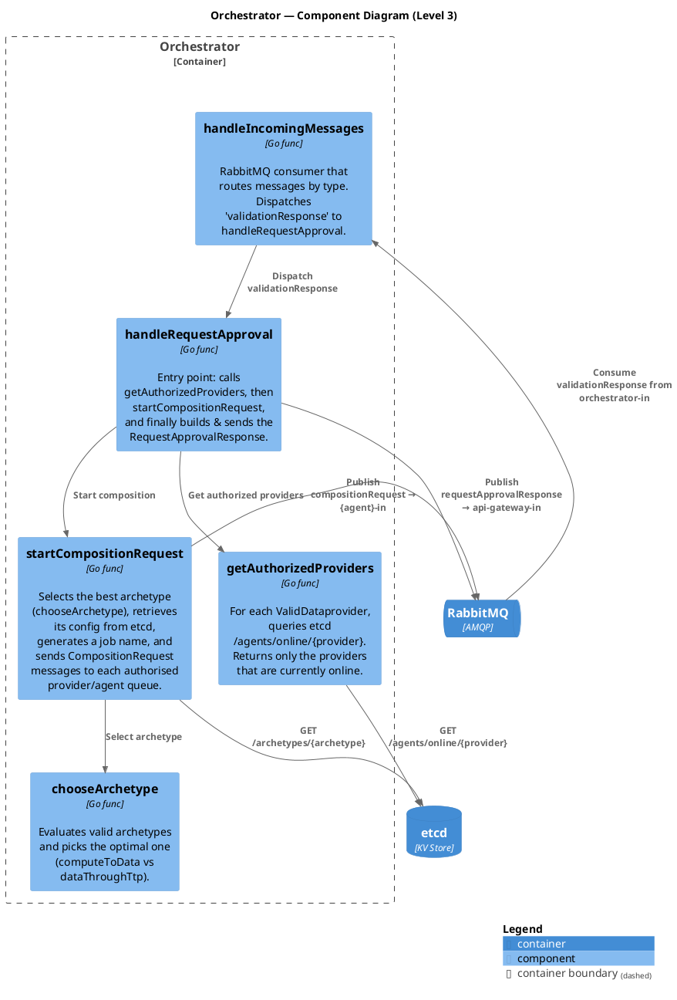
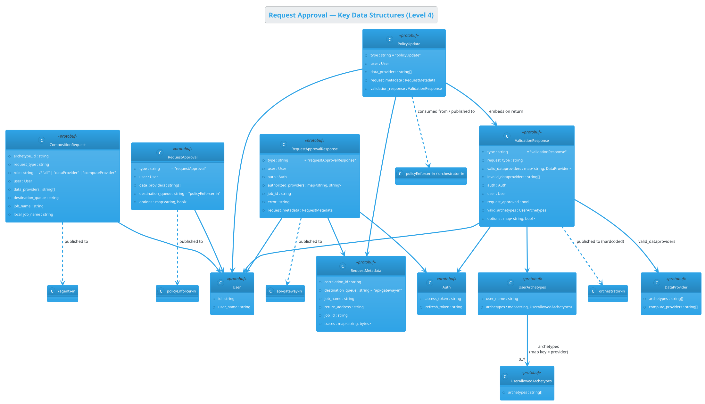
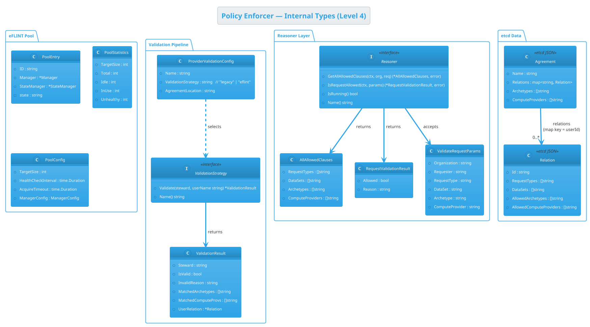

# C4 Diagrams — Request Approval Flow

This document describes the current DYNAMOS Request Approval flow using the
[C4 model](https://c4model.com/) (System Context, Container, Component, Code).
Each level is embedded as a PlantUML block that uses the
[C4-PlantUML](https://github.com/plantuml-stdlib/C4-PlantUML) standard library.

The key difference from the [legacy C4 diagrams](./old_request_approval_c4.md)
is the **dual-strategy validation** in the Policy Enforcer: per-provider strategy
resolution (Legacy JSON vs eFLINT), an eFLINT instance pool for concurrent
stateless validation, a reasoner abstraction for the HTTP API, and a repository
pattern for etcd access.

> **See also:**
> - [PlantUML activity, sequence & component diagrams](./request_approval_diagrams.md)
> - [Policy Enforcer technical documentation](../development_guide/policy_enforcer.md)
> - [Legacy C4 diagrams](./old_request_approval_c4.md)

---

## Level 1 — System Context

Shows DYNAMOS as a single system box in the context of its users and any
external systems it depends on.

---

## Level 2 — Container

Zooms into the DYNAMOS system to reveal its main runtime containers and the
technologies that connect them. The Policy Enforcer now includes an eFLINT
instance pool and an HTTP API alongside its RabbitMQ message processing.

---

## Level 3 — Component

Decomposes each container into its key internal components and shows how they
collaborate during the request approval flow.

### 3a — API Gateway Components

### 3b — Policy Enforcer Components

### 3c — Orchestrator Components

---

## Level 4 — Code

Shows the key data structures (protobuf messages) that flow between the
containers, the etcd key-space, and the internal Policy Enforcer types. This
level is derived from the current codebase.

### 4a — Protobuf Message Structures

### 4b — Policy Enforcer Internal Types

### 4c — etcd Key Space

```plantuml
@startuml C4_Level4_etcd
!theme cerulean

title Request Approval — etcd Key Space (Level 4)

package "etcd Key-Value Store" {

    object "/policyEnforcer/agreements/{steward}" as agreements {
        name : string
        relations : map<userId, Relation>
        archetypes : string[]
        computeProviders : string[]
    }

    object "/policyEnforcer/eflintModels/{provider}" as eflintModels {
        <raw eFLINT specification text>
    }

    object "/policyEnforcer/configs/{provider}" as configs {
        name : string
        validationStrategy : string  // "legacy" | "eflint"
        agreementLocation : string
    }

    object "/policyEnforcer/eflint-states/{provider}" as eflintStates {
        graph : JSON (execution graph)
        checkpoint_name : string
    }

    object "/agents/online/{name}" as agentOnline {
        name : string
        dns : string
        routingKey : string
    }

    object "/archetypes/{name}" as archetypes {
        name : string
        type : string  // "computeToData" | "dataThroughTtp"
        config : JSON
    }
}

note right of agreements
  Read by **LegacyValidationStrategy**
  Legacy JSON agreement path
end note

note right of eflintModels
  Read by **EflintReasoner**
  Loaded into pool instances
  via SendPhrases command
end note

note right of configs
  Read by **ValidationService.resolveStrategy()**
  Determines which strategy to use
  per data provider
end note

note right of eflintStates
  Read/written by **EflintStateRepository**
  POC state persistence
end note

note right of agentOnline
  Read by **Orchestrator**
  in getAuthorizedProviders()
end note

note right of archetypes
  Read by **Orchestrator**
  in startCompositionRequest()
end note

@enduml
```

---

## How to Render

These diagrams use the [C4-PlantUML](https://github.com/plantuml-stdlib/C4-PlantUML) standard library
which is bundled with PlantUML since version 1.2021.1. You can render them with:

- **VS Code** — install the *PlantUML* extension (`jebbs.plantuml`) and preview the fenced blocks.
- **CLI** — `java -jar plantuml.jar request_approval_c4.md` (PlantUML renders `plantuml` fenced blocks inside Markdown).
- **Online** — paste each block into [plantuml.com](https://www.plantuml.com/plantuml/uml).
