# Request Approval Diagrams (PlantUML)

This page embeds the Request Approval diagrams as PlantUML blocks, reflecting the
**current codebase** with dual-strategy validation (Legacy JSON + eFLINT) in the
Policy Enforcer.

Each activity and sequence section starts with a **high-level overview** that
shows only the inter-service flow, followed by **per-service detail diagrams**
that zoom into the internal logic of each microservice.

> **See also:**
> - [C4 model diagrams](./request_approval_c4.md)
> - [Policy Enforcer technical documentation](../development_guide/policy_enforcer.md)
> - [Legacy (old) request approval diagrams](./old_request_approval_diagrams.md)

---

## 1. Activity Diagrams

### 1.1 High-Level Overview

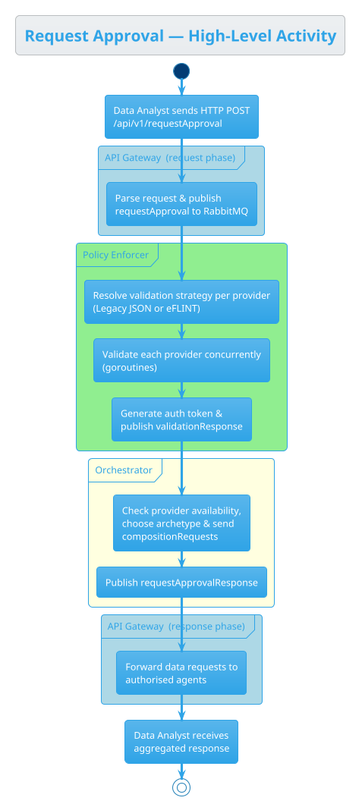
```plantuml
@startuml Activity - High Level Overview
!theme cerulean

title Request Approval — High-Level Activity

start

:Data Analyst sends HTTP POST\n/api/v1/requestApproval;

partition "API Gateway  (request phase)" #LightBlue {
    :Parse request & publish\nrequestApproval to RabbitMQ;
}

partition "Policy Enforcer" #LightGreen {
    :Resolve validation strategy per provider\n(Legacy JSON or eFLINT);
    :Validate each provider concurrently\n(goroutines);
    :Generate auth token &\npublish validationResponse;
}

partition "Orchestrator" #LightYellow {
    :Check provider availability,\nchoose archetype & send\ncompositionRequests;
    :Publish requestApprovalResponse;
}

partition "API Gateway  (response phase)" #LightBlue {
    :Forward data requests to\nauthorised agents;
}

:Data Analyst receives\naggregated response;

stop

@enduml
```

### 1.2 API Gateway — Request Phase

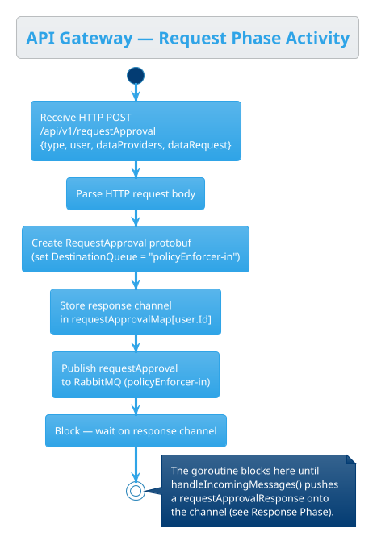
```plantuml
@startuml Activity - API Gateway Request
!theme cerulean

title API Gateway — Request Phase Activity

start

:Receive HTTP POST\n/api/v1/requestApproval\n{type, user, dataProviders, dataRequest};

:Parse HTTP request body;

:Create RequestApproval protobuf\n(set DestinationQueue = "policyEnforcer-in");

:Store response channel\nin requestApprovalMap[user.Id];

:Publish requestApproval\nto RabbitMQ (policyEnforcer-in);

:Block — wait on response channel;

stop

note right
  The goroutine blocks here until
  handleIncomingMessages() pushes
  a requestApprovalResponse onto
  the channel (see Response Phase).
end note

@enduml
```

### 1.3 Policy Enforcer — Dual-Strategy Validation

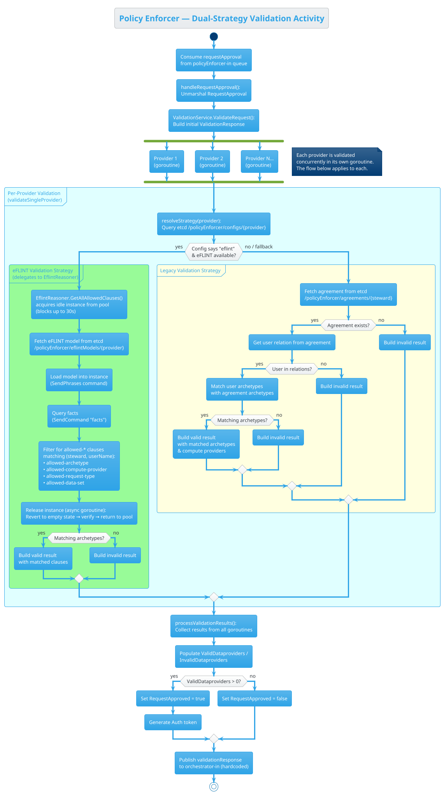
```plantuml
@startuml Activity - Policy Enforcer
!theme cerulean

title Policy Enforcer — Dual-Strategy Validation Activity

start

:Consume requestApproval\nfrom policyEnforcer-in queue;

:handleRequestApproval():\nUnmarshal RequestApproval;

:ValidationService.ValidateRequest():\nBuild initial ValidationResponse;

fork
    :Provider 1\n(goroutine);
fork again
    :Provider 2\n(goroutine);
fork again
    :Provider N…\n(goroutine);
end fork

note right
  Each provider is validated
  concurrently in its own goroutine.
  The flow below applies to each.
end note

partition "Per-Provider Validation\n(validateSingleProvider)" #LightCyan {

    :resolveStrategy(provider):\nQuery etcd /policyEnforcer/configs/{provider};

    if (Config says "eflint"\n& eFLINT available?) then (yes)

        partition "eFLINT Validation Strategy\n(delegates to EflintReasoner)" #PaleGreen {
            :EflintReasoner.GetAllAllowedClauses()\nacquires idle instance from pool\n(blocks up to 30s);

            :Fetch eFLINT model from etcd\n/policyEnforcer/eflintModels/{provider};

            :Load model into instance\n(SendPhrases command);

            :Query facts\n(SendCommand "facts");

            :Filter for allowed-* clauses\nmatching (steward, userName):\n• allowed-archetype\n• allowed-compute-provider\n• allowed-request-type\n• allowed-data-set;

            :Release instance (async goroutine):\nRevert to empty state → verify → return to pool;

            if (Matching archetypes?) then (yes)
                :Build valid result\nwith matched clauses;
            else (no)
                :Build invalid result;
            endif
        }

    else (no / fallback)

        partition "Legacy Validation Strategy" #LightYellow {
            :Fetch agreement from etcd\n/policyEnforcer/agreements/{steward};

            if (Agreement exists?) then (yes)
                :Get user relation from agreement;

                if (User in relations?) then (yes)
                    :Match user archetypes\nwith agreement archetypes;

                    if (Matching archetypes?) then (yes)
                        :Build valid result\nwith matched archetypes\n& compute providers;
                    else (no)
                        :Build invalid result;
                    endif
                else (no)
                    :Build invalid result;
                endif
            else (no)
                :Build invalid result;
            endif
        }

    endif
}

:processValidationResults():\nCollect results from all goroutines;

:Populate ValidDataproviders /\nInvalidDataproviders;

if (ValidDataproviders > 0?) then (yes)
    :Set RequestApproved = true;
    :Generate Auth token;
else (no)
    :Set RequestApproved = false;
endif

:Publish validationResponse\nto orchestrator-in (hardcoded);

stop

@enduml
```

### 1.4 Policy Enforcer — eFLINT Pool Lifecycle

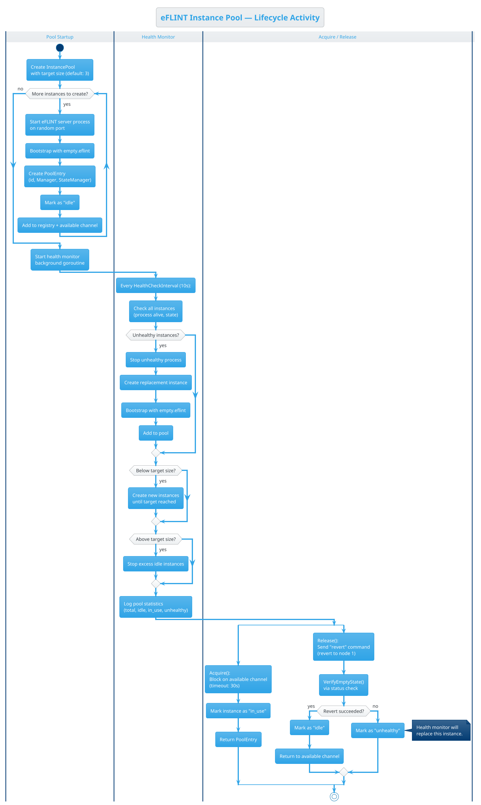
```plantuml
@startuml Activity - eFLINT Pool Lifecycle
!theme cerulean

title eFLINT Instance Pool — Lifecycle Activity

|Pool Startup|

start

:Create InstancePool\nwith target size (default: 3);

while (More instances to create?) is (yes)
    :Start eFLINT server process\non random port;
    :Bootstrap with empty.eflint;
    :Create PoolEntry\n(id, Manager, StateManager);
    :Mark as "idle";
    :Add to registry + available channel;
endwhile (no)

:Start health monitor\nbackground goroutine;

|Health Monitor|

:Every HealthCheckInterval (10s):;

:Check all instances\n(process alive, state);

if (Unhealthy instances?) then (yes)
    :Stop unhealthy process;
    :Create replacement instance;
    :Bootstrap with empty.eflint;
    :Add to pool;
endif

if (Below target size?) then (yes)
    :Create new instances\nuntil target reached;
endif

if (Above target size?) then (yes)
    :Stop excess idle instances;
endif

:Log pool statistics\n(total, idle, in_use, unhealthy);

|Acquire / Release|

split
    :Acquire():\nBlock on available channel\n(timeout: 30s);
    :Mark instance as "in_use";
    :Return PoolEntry;
split again
    :Release():\nSend "revert" command\n(revert to node 1);
    :VerifyEmptyState()\nvia status check;

    if (Revert succeeded?) then (yes)
        :Mark as "idle";
        :Return to available channel;
    else (no)
        :Mark as "unhealthy";
        note right
          Health monitor will
          replace this instance.
        end note
    endif
end split

stop

@enduml
```

### 1.5 Orchestrator

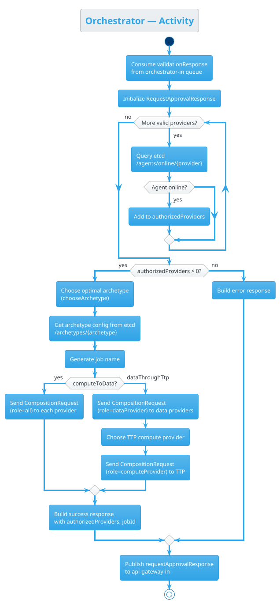
```plantuml
@startuml Activity - Orchestrator
!theme cerulean

title Orchestrator — Activity

start

:Consume validationResponse\nfrom orchestrator-in queue;

:Initialize RequestApprovalResponse;

while (More valid providers?) is (yes)
    :Query etcd\n/agents/online/{provider};

    if (Agent online?) then (yes)
        :Add to authorizedProviders;
    endif
endwhile (no)

if (authorizedProviders > 0?) then (yes)
    :Choose optimal archetype\n(chooseArchetype);
    :Get archetype config from etcd\n/archetypes/{archetype};
    :Generate job name;

    if (computeToData?) then (yes)
        :Send CompositionRequest\n(role=all) to each provider;
    else (dataThroughTtp)
        :Send CompositionRequest\n(role=dataProvider) to data providers;
        :Choose TTP compute provider;
        :Send CompositionRequest\n(role=computeProvider) to TTP;
    endif

    :Build success response\nwith authorizedProviders, jobId;
else (no)
    :Build error response;
endif

:Publish requestApprovalResponse\nto api-gateway-in;

stop

@enduml
```

### 1.6 API Gateway — Response Phase

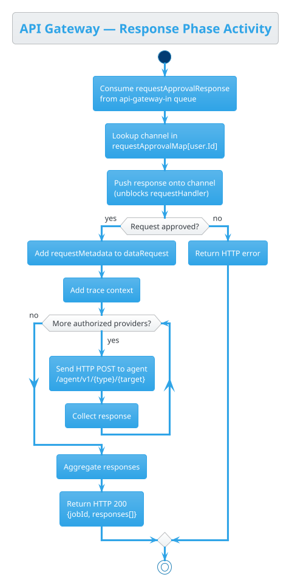
```plantuml
@startuml Activity - API Gateway Response
!theme cerulean

title API Gateway — Response Phase Activity

start

:Consume requestApprovalResponse\nfrom api-gateway-in queue;

:Lookup channel in\nrequestApprovalMap[user.Id];

:Push response onto channel\n(unblocks requestHandler);

if (Request approved?) then (yes)
    :Add requestMetadata to dataRequest;
    :Add trace context;

    while (More authorized providers?) is (yes)
        :Send HTTP POST to agent\n/agent/v1/{type}/{target};
        :Collect response;
    endwhile (no)

    :Aggregate responses;
    :Return HTTP 200\n{jobId, responses[]};
else (no)
    :Return HTTP error;
endif

stop

@enduml
```

### 1.7 Agent

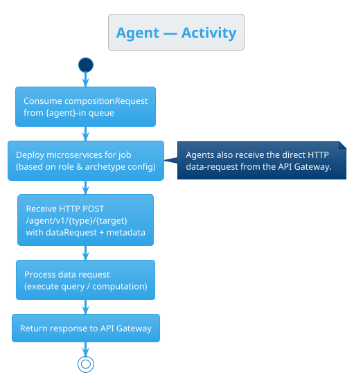
```plantuml
@startuml Activity - Agent
!theme cerulean

title Agent — Activity

start

:Consume compositionRequest\nfrom {agent}-in queue;

:Deploy microservices for job\n(based on role & archetype config);

note right
  Agents also receive the direct HTTP
  data-request from the API Gateway.
end note

:Receive HTTP POST\n/agent/v1/{type}/{target}\nwith dataRequest + metadata;

:Process data request\n(execute query / computation);

:Return response to API Gateway;

stop

@enduml
```

---

## 2. Sequence Diagrams

### 2.1 High-Level Overview

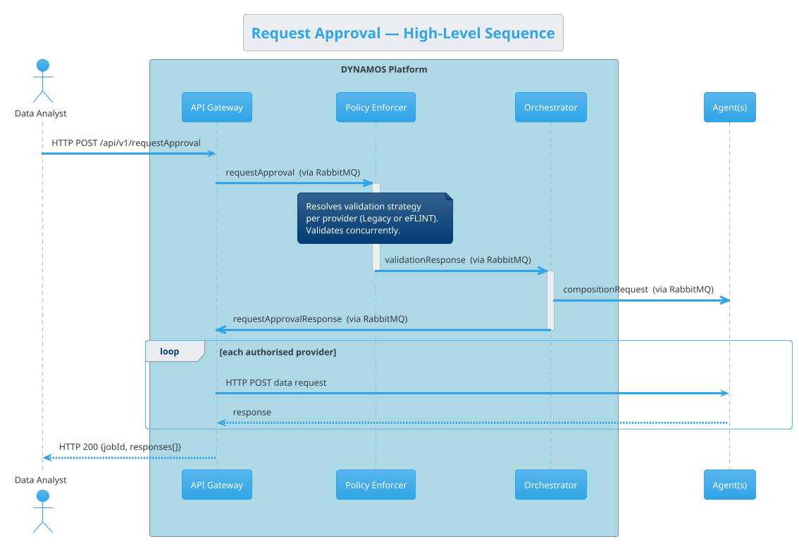
```plantuml
@startuml Sequence - High Level Overview
!theme cerulean

title Request Approval — High-Level Sequence

actor "Data Analyst" as Client
box "DYNAMOS Platform" #LightBlue
    participant "API Gateway"     as API
    participant "Policy Enforcer" as PE
    participant "Orchestrator"    as Orch
end box
participant "Agent(s)" as Agents

Client -> API : HTTP POST /api/v1/requestApproval

API ->> PE   : requestApproval  (via RabbitMQ)
activate PE

note over PE
  Resolves validation strategy
  per provider (Legacy or eFLINT).
  Validates concurrently.
end note

PE ->> Orch  : validationResponse  (via RabbitMQ)
deactivate PE
activate Orch
Orch ->> Agents : compositionRequest  (via RabbitMQ)
Orch ->> API : requestApprovalResponse  (via RabbitMQ)
deactivate Orch

loop each authorised provider
    API -> Agents  : HTTP POST data request
    Agents --> API : response
end

API --> Client : HTTP 200 {jobId, responses[]}

@enduml
```

### 2.2 API Gateway — Request Phase

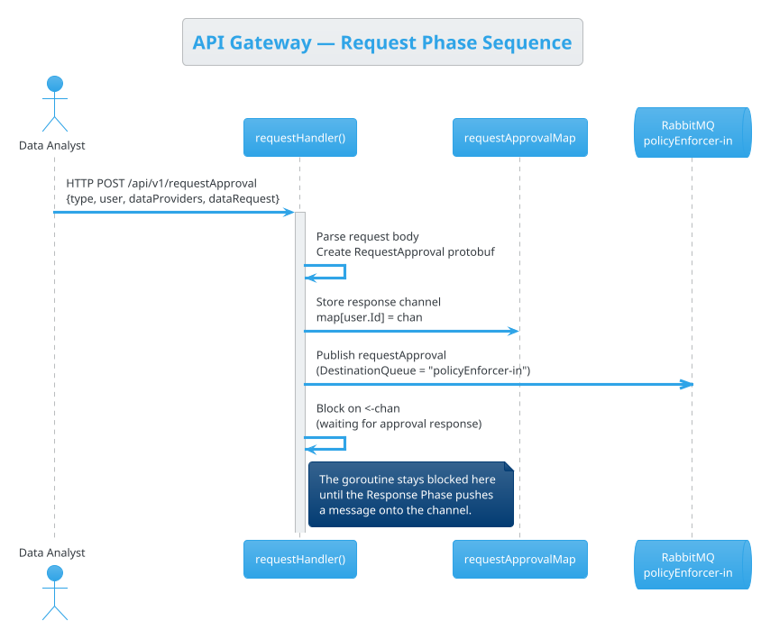
```plantuml
@startuml Sequence - API Gateway Request
!theme cerulean

title API Gateway — Request Phase Sequence

actor "Data Analyst" as Client
participant "requestHandler()" as Handler
participant "requestApprovalMap" as Map
queue "RabbitMQ\npolicyEnforcer-in" as MQ_PE

Client -> Handler : HTTP POST /api/v1/requestApproval\n{type, user, dataProviders, dataRequest}
activate Handler

Handler -> Handler : Parse request body\nCreate RequestApproval protobuf

Handler -> Map : Store response channel\nmap[user.Id] = chan

Handler ->> MQ_PE : Publish requestApproval\n(DestinationQueue = "policyEnforcer-in")

Handler -> Handler : Block on <-chan\n(waiting for approval response)

note right of Handler
  The goroutine stays blocked here
  until the Response Phase pushes
  a message onto the channel.
end note

@enduml
```

### 2.3 Policy Enforcer — Dual-Strategy Validation (Simplified)

A condensed view that shows the overall flow without expanding the internal
details of each strategy. For the eFLINT pool lifecycle and instance
interaction, see [§2.4](#24-policy-enforcer--eflint-pool-acquirerelease-cycle).

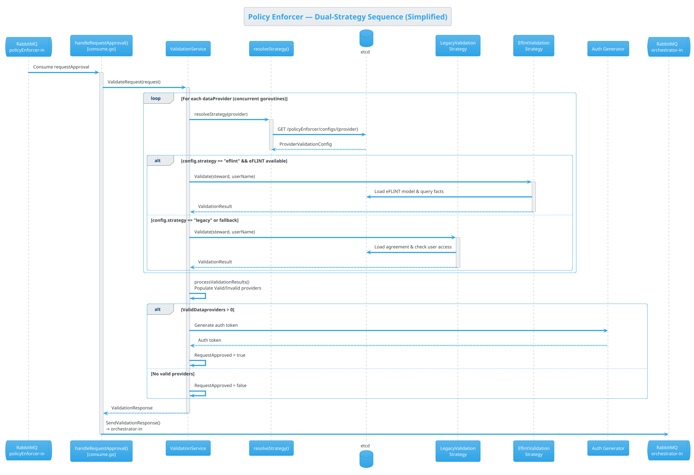
```plantuml
@startuml Sequence - Policy Enforcer (Simplified)
!theme cerulean

title Policy Enforcer — Dual-Strategy Sequence (Simplified)

queue "RabbitMQ\npolicyEnforcer-in" as MQ_PE
participant "handleRequestApproval()\n[consume.go]" as HandleRA
participant "ValidationService" as ValSvc
participant "resolveStrategy()" as Resolve
database "etcd" as etcd

participant "LegacyValidation\nStrategy" as Legacy
participant "EflintValidation\nStrategy" as Eflint

participant "Auth Generator" as Auth
queue "RabbitMQ\norchestrator-in" as MQ_Orch

MQ_PE -> HandleRA : Consume requestApproval
activate HandleRA

HandleRA -> ValSvc : ValidateRequest(request)
activate ValSvc

loop For each dataProvider (concurrent goroutines)
    ValSvc -> Resolve : resolveStrategy(provider)
    activate Resolve
    Resolve -> etcd : GET /policyEnforcer/configs/{provider}
    etcd --> Resolve : ProviderValidationConfig
    deactivate Resolve

    alt config.strategy == "eflint" && eFLINT available
        ValSvc -> Eflint : Validate(steward, userName)
        activate Eflint
        Eflint -> etcd : Load eFLINT model & query facts
        Eflint --> ValSvc : ValidationResult
        deactivate Eflint

    else config.strategy == "legacy" or fallback
        ValSvc -> Legacy : Validate(steward, userName)
        activate Legacy
        Legacy -> etcd : Load agreement & check user access
        Legacy --> ValSvc : ValidationResult
        deactivate Legacy
    end
end

ValSvc -> ValSvc : processValidationResults()\nPopulate Valid/Invalid providers

alt ValidDataproviders > 0
    ValSvc -> Auth : Generate auth token
    Auth --> ValSvc : Auth token
    ValSvc -> ValSvc : RequestApproved = true
else No valid providers
    ValSvc -> ValSvc : RequestApproved = false
end

ValSvc --> HandleRA : ValidationResponse
deactivate ValSvc

HandleRA -> MQ_Orch : SendValidationResponse()\n→ orchestrator-in
deactivate HandleRA

@enduml
```

### 2.3.1 Policy Enforcer — Dual-Strategy Validation (Detailed)

The fully expanded version showing internal logic for both strategies,
including the eFLINT pool acquire/release and legacy agreement lookups.

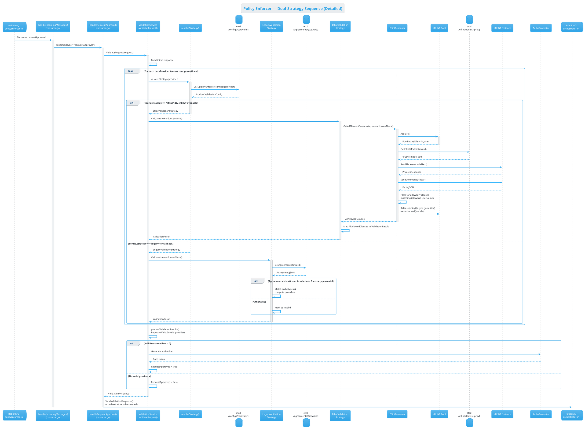
```plantuml
@startuml Sequence - Policy Enforcer
!theme cerulean

title Policy Enforcer — Dual-Strategy Sequence (Detailed)

queue "RabbitMQ\npolicyEnforcer-in" as MQ_PE
participant "handleIncomingMessages()\n[consume.go]" as Router
participant "handleRequestApproval()\n[consume.go]" as HandleRA
participant "ValidationService\n.ValidateRequest()" as ValSvc
participant "resolveStrategy()" as Resolve
database "etcd\n/configs/{provider}" as etcdConfigs

participant "LegacyValidation\nStrategy" as Legacy
database "etcd\n/agreements/{steward}" as etcdAgreements

participant "EflintValidation\nStrategy" as Eflint
participant "EflintReasoner" as Reasoner
participant "eFLINT Pool" as Pool
database "etcd\n/eflintModels/{prov}" as etcdModels
participant "eFLINT Instance" as EflintInst

participant "Auth Generator" as Auth
queue "RabbitMQ\norchestrator-in" as MQ_Orch

MQ_PE -> Router : Consume requestApproval
activate Router

Router -> HandleRA : Dispatch (type = "requestApproval")
activate HandleRA

HandleRA -> ValSvc : ValidateRequest(request)
activate ValSvc

ValSvc -> ValSvc : Build initial response

loop For each dataProvider (concurrent goroutines)
    ValSvc -> Resolve : resolveStrategy(provider)
    activate Resolve
    Resolve -> etcdConfigs : GET /policyEnforcer/configs/{provider}
    etcdConfigs --> Resolve : ProviderValidationConfig

    alt config.strategy == "eflint" && eFLINT available
        Resolve --> ValSvc : EflintValidationStrategy
        deactivate Resolve

        ValSvc -> Eflint : Validate(steward, userName)
        activate Eflint

        Eflint -> Reasoner : GetAllAllowedClauses(ctx, steward, userName)
        activate Reasoner

        Reasoner -> Pool : Acquire()
        activate Pool
        Pool --> Reasoner : PoolEntry (idle → in_use)
        deactivate Pool

        Reasoner -> etcdModels : GetEflintModel(steward)
        etcdModels --> Reasoner : eFLINT model text

        Reasoner -> EflintInst : SendPhrases(modelText)
        EflintInst --> Reasoner : PhrasesResponse

        Reasoner -> EflintInst : SendCommand("facts")
        EflintInst --> Reasoner : Facts JSON

        Reasoner -> Reasoner : Filter for allowed-* clauses\nmatching (steward, userName)

        Reasoner ->> Pool : Release(entry) [async goroutine]\n(revert → verify → idle)

        Reasoner --> Eflint : AllAllowedClauses
        deactivate Reasoner

        Eflint -> Eflint : Map AllAllowedClauses to ValidationResult

        Eflint --> ValSvc : ValidationResult
        deactivate Eflint

    else config.strategy == "legacy" or fallback
        Resolve --> ValSvc : LegacyValidationStrategy
        deactivate Resolve

        ValSvc -> Legacy : Validate(steward, userName)
        activate Legacy

        Legacy -> etcdAgreements : GetAgreement(steward)
        etcdAgreements --> Legacy : Agreement JSON

        alt Agreement exists & user in relations & archetypes match
            Legacy -> Legacy : Match archetypes &\ncompute providers
        else Otherwise
            Legacy -> Legacy : Mark as invalid
        end

        Legacy --> ValSvc : ValidationResult
        deactivate Legacy
    end
end

ValSvc -> ValSvc : processValidationResults()\nPopulate Valid/Invalid providers

alt ValidDataproviders > 0
    ValSvc -> Auth : Generate auth token
    Auth --> ValSvc : Auth token
    ValSvc -> ValSvc : RequestApproved = true
else No valid providers
    ValSvc -> ValSvc : RequestApproved = false
end

ValSvc --> HandleRA : ValidationResponse
deactivate ValSvc

HandleRA -> MQ_Orch : SendValidationResponse()\n→ orchestrator-in (hardcoded)
deactivate HandleRA
deactivate Router

@enduml
```

### 2.4 Policy Enforcer — eFLINT Pool Acquire/Release Cycle

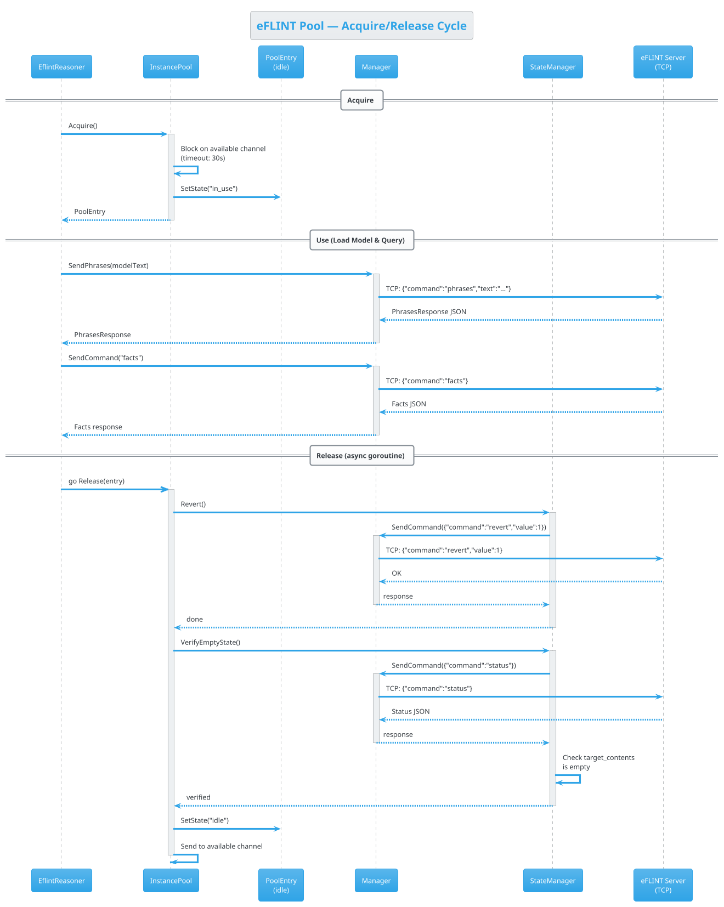
```plantuml
@startuml Sequence - eFLINT Pool Cycle
!theme cerulean

title eFLINT Pool — Acquire/Release Cycle

participant "EflintReasoner" as Caller
participant "InstancePool" as Pool
participant "PoolEntry\n(idle)" as Entry
participant "Manager" as Mgr
participant "StateManager" as SM
participant "eFLINT Server\n(TCP)" as Server

== Acquire ==

Caller -> Pool : Acquire()
activate Pool
Pool -> Pool : Block on available channel\n(timeout: 30s)
Pool -> Entry : SetState("in_use")
Pool --> Caller : PoolEntry
deactivate Pool

== Use (Load Model & Query) ==

Caller -> Mgr : SendPhrases(modelText)
activate Mgr
Mgr -> Server : TCP: {"command":"phrases","text":"..."}
Server --> Mgr : PhrasesResponse JSON
Mgr --> Caller : PhrasesResponse
deactivate Mgr

Caller -> Mgr : SendCommand("facts")
activate Mgr
Mgr -> Server : TCP: {"command":"facts"}
Server --> Mgr : Facts JSON
Mgr --> Caller : Facts response
deactivate Mgr

== Release (async goroutine) ==

Caller ->> Pool : go Release(entry)
activate Pool

Pool -> SM : Revert()
activate SM
SM -> Mgr : SendCommand({"command":"revert","value":1})
activate Mgr
Mgr -> Server : TCP: {"command":"revert","value":1}
Server --> Mgr : OK
Mgr --> SM : response
deactivate Mgr
SM --> Pool : done
deactivate SM

Pool -> SM : VerifyEmptyState()
activate SM
SM -> Mgr : SendCommand({"command":"status"})
activate Mgr
Mgr -> Server : TCP: {"command":"status"}
Server --> Mgr : Status JSON
Mgr --> SM : response
deactivate Mgr
SM -> SM : Check target_contents\nis empty
SM --> Pool : verified
deactivate SM

Pool -> Entry : SetState("idle")
Pool -> Pool : Send to available channel
deactivate Pool

@enduml
```

### 2.5 Policy Enforcer — HTTP API Flow

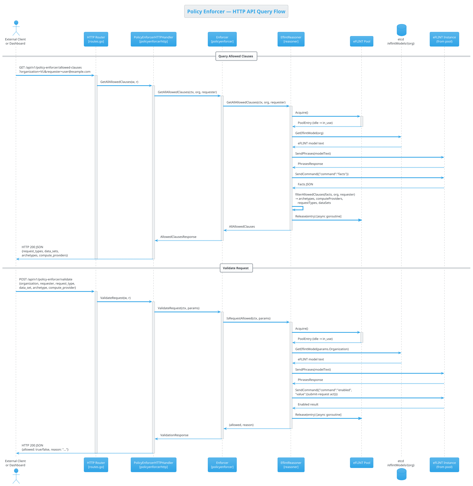
```plantuml
@startuml Sequence - Policy Enforcer HTTP API
!theme cerulean

title Policy Enforcer — HTTP API Query Flow

actor "External Client\nor Dashboard" as Client
participant "HTTP Router\n[routes.go]" as Routes
participant "PolicyEnforcerHTTPHandler\n[policyenforcerhttp]" as HTTPHandler
participant "Enforcer\n[policyenforcer]" as Enforcer
participant "EflintReasoner\n[reasoner]" as Reasoner
participant "eFLINT Pool" as Pool
database "etcd\n/eflintModels/{org}" as etcdModels
participant "eFLINT Instance\n(from pool)" as Server

== Query Allowed Clauses ==

Client -> Routes : GET /api/v1/policy-enforcer/allowed-clauses\n?organization=VU&requester=user@example.com
activate Routes

Routes -> HTTPHandler : GetAllAllowedClauses(w, r)
activate HTTPHandler

HTTPHandler -> Enforcer : GetAllAllowedClauses(ctx, org, requester)
activate Enforcer

Enforcer -> Reasoner : GetAllAllowedClauses(ctx, org, requester)
activate Reasoner

Reasoner -> Pool : Acquire()
activate Pool
Pool --> Reasoner : PoolEntry (idle → in_use)
deactivate Pool

Reasoner -> etcdModels : GetEflintModel(org)
etcdModels --> Reasoner : eFLINT model text

Reasoner -> Server : SendPhrases(modelText)
Server --> Reasoner : PhrasesResponse

Reasoner -> Server : SendCommand({"command":"facts"})
Server --> Reasoner : Facts JSON

Reasoner -> Reasoner : filterAllowedClauses(facts, org, requester)\n→ archetypes, computeProviders,\n   requestTypes, dataSets

Reasoner ->> Pool : Release(entry) [async goroutine]

Reasoner --> Enforcer : AllAllowedClauses
deactivate Reasoner

Enforcer --> HTTPHandler : AllowedClausesResponse
deactivate Enforcer

HTTPHandler --> Client : HTTP 200 JSON\n{request_types, data_sets,\narchetypes, compute_providers}
deactivate HTTPHandler
deactivate Routes

== Validate Request ==

Client -> Routes : POST /api/v1/policy-enforcer/validate\n{organization, requester, request_type,\ndata_set, archetype, compute_provider}
activate Routes

Routes -> HTTPHandler : ValidateRequest(w, r)
activate HTTPHandler

HTTPHandler -> Enforcer : ValidateRequest(ctx, params)
activate Enforcer

Enforcer -> Reasoner : IsRequestAllowed(ctx, params)
activate Reasoner

Reasoner -> Pool : Acquire()
activate Pool
Pool --> Reasoner : PoolEntry (idle → in_use)
deactivate Pool

Reasoner -> etcdModels : GetEflintModel(params.Organization)
etcdModels --> Reasoner : eFLINT model text

Reasoner -> Server : SendPhrases(modelText)
Server --> Reasoner : PhrasesResponse

Reasoner -> Server : SendCommand({"command":"enabled",\n"value":{submit-request act}})
Server --> Reasoner : Enabled result

Reasoner ->> Pool : Release(entry) [async goroutine]

Reasoner --> Enforcer : (allowed, reason)
deactivate Reasoner

Enforcer --> HTTPHandler : ValidationResponse
deactivate Enforcer

HTTPHandler --> Client : HTTP 200 JSON\n{allowed: true/false, reason: "..."}
deactivate HTTPHandler
deactivate Routes

@enduml
```

### 2.6 Orchestrator

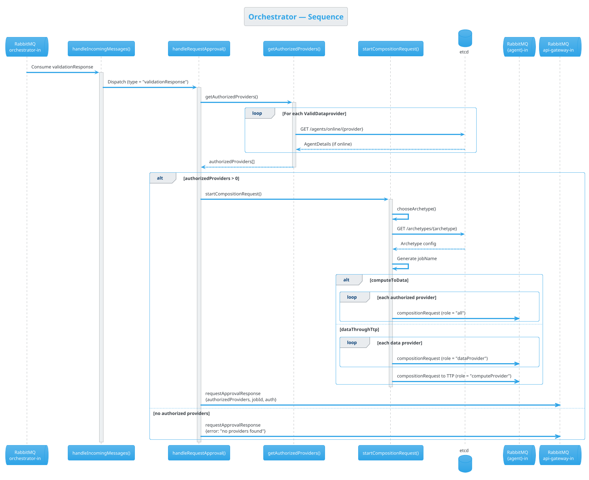
```plantuml
@startuml Sequence - Orchestrator
!theme cerulean

title Orchestrator — Sequence

queue "RabbitMQ\norchestrator-in" as MQ_Orch
participant "handleIncomingMessages()" as Router
participant "handleRequestApproval()" as Handle
participant "getAuthorizedProviders()" as AuthProv
participant "startCompositionRequest()" as Compose
database "etcd" as etcd
queue "RabbitMQ\n{agent}-in" as MQ_Agent
queue "RabbitMQ\napi-gateway-in" as MQ_API

MQ_Orch -> Router : Consume validationResponse
activate Router

Router -> Handle : Dispatch (type = "validationResponse")
activate Handle

Handle -> AuthProv : getAuthorizedProviders()
activate AuthProv

loop For each ValidDataprovider
    AuthProv -> etcd : GET /agents/online/{provider}
    etcd --> AuthProv : AgentDetails (if online)
end

AuthProv --> Handle : authorizedProviders[]
deactivate AuthProv

alt authorizedProviders > 0
    Handle -> Compose : startCompositionRequest()
    activate Compose

    Compose -> Compose : chooseArchetype()
    Compose -> etcd : GET /archetypes/{archetype}
    etcd --> Compose : Archetype config
    Compose -> Compose : Generate jobName

    alt computeToData
        loop each authorized provider
            Compose ->> MQ_Agent : compositionRequest (role = "all")
        end
    else dataThroughTtp
        loop each data provider
            Compose ->> MQ_Agent : compositionRequest (role = "dataProvider")
        end
        Compose ->> MQ_Agent : compositionRequest to TTP (role = "computeProvider")
    end

    deactivate Compose

    Handle ->> MQ_API : requestApprovalResponse\n{authorizedProviders, jobId, auth}
else no authorized providers
    Handle ->> MQ_API : requestApprovalResponse\n{error: "no providers found"}
end

deactivate Handle
deactivate Router

@enduml
```

### 2.7 API Gateway — Response Phase

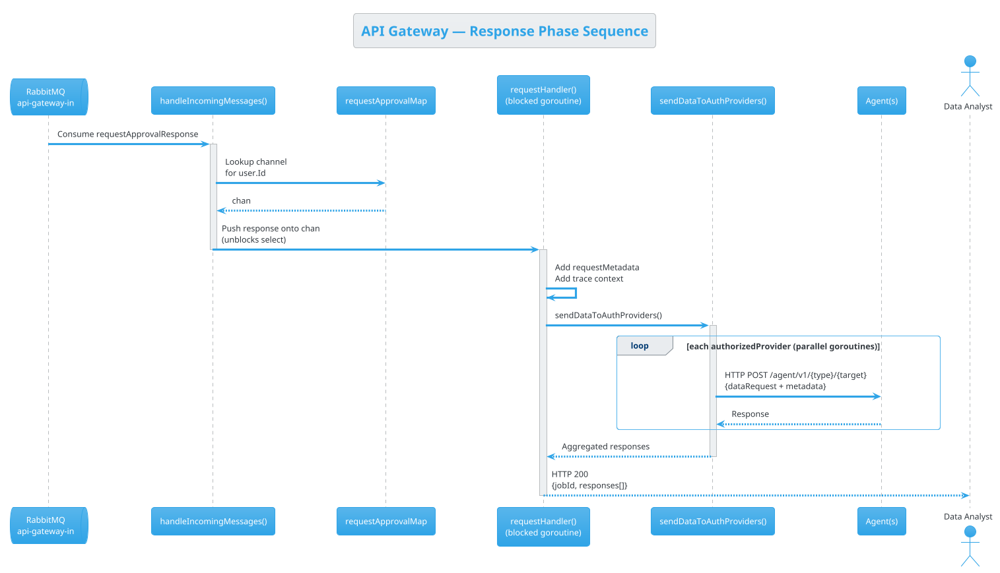
```plantuml
@startuml Sequence - API Gateway Response
!theme cerulean

title API Gateway — Response Phase Sequence

queue "RabbitMQ\napi-gateway-in" as MQ_API
participant "handleIncomingMessages()" as Incoming
participant "requestApprovalMap" as Map
participant "requestHandler()\n(blocked goroutine)" as Handler
participant "sendDataToAuthProviders()" as Send
participant "Agent(s)" as Agents
actor "Data Analyst" as Client

MQ_API -> Incoming : Consume requestApprovalResponse
activate Incoming

Incoming -> Map : Lookup channel\nfor user.Id
Map --> Incoming : chan

Incoming -> Handler : Push response onto chan\n(unblocks select)
deactivate Incoming
activate Handler

Handler -> Handler : Add requestMetadata\nAdd trace context

Handler -> Send : sendDataToAuthProviders()
activate Send

loop each authorizedProvider (parallel goroutines)
    Send -> Agents : HTTP POST /agent/v1/{type}/{target}\n{dataRequest + metadata}
    Agents --> Send : Response
end

Send --> Handler : Aggregated responses
deactivate Send

Handler --> Client : HTTP 200\n{jobId, responses[]}
deactivate Handler

@enduml
```

### 2.8 Agent

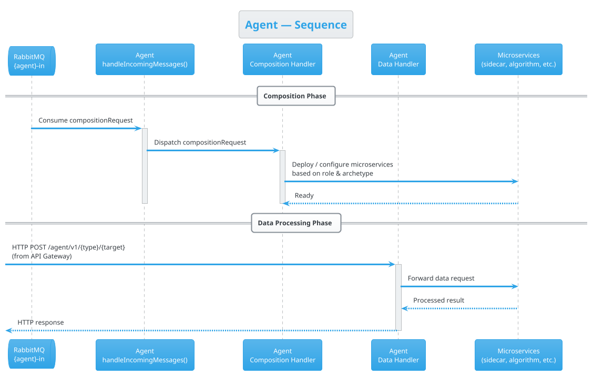
```plantuml
@startuml Sequence - Agent
!theme cerulean

title Agent — Sequence

queue "RabbitMQ\n{agent}-in" as MQ_Agent
participant "Agent\nhandleIncomingMessages()" as AgentRouter
participant "Agent\nComposition Handler" as Composition
participant "Agent\nData Handler" as DataHandler
participant "Microservices\n(sidecar, algorithm, etc.)" as Services

== Composition Phase ==

MQ_Agent -> AgentRouter : Consume compositionRequest
activate AgentRouter
AgentRouter -> Composition : Dispatch compositionRequest
activate Composition
Composition -> Services : Deploy / configure microservices\nbased on role & archetype
Services --> Composition : Ready
deactivate Composition
deactivate AgentRouter

== Data Processing Phase ==

-> DataHandler : HTTP POST /agent/v1/{type}/{target}\n(from API Gateway)
activate DataHandler
DataHandler -> Services : Forward data request
Services --> DataHandler : Processed result
<-- DataHandler : HTTP response
deactivate DataHandler

@enduml
```

### 2.9 Policy Update Flow

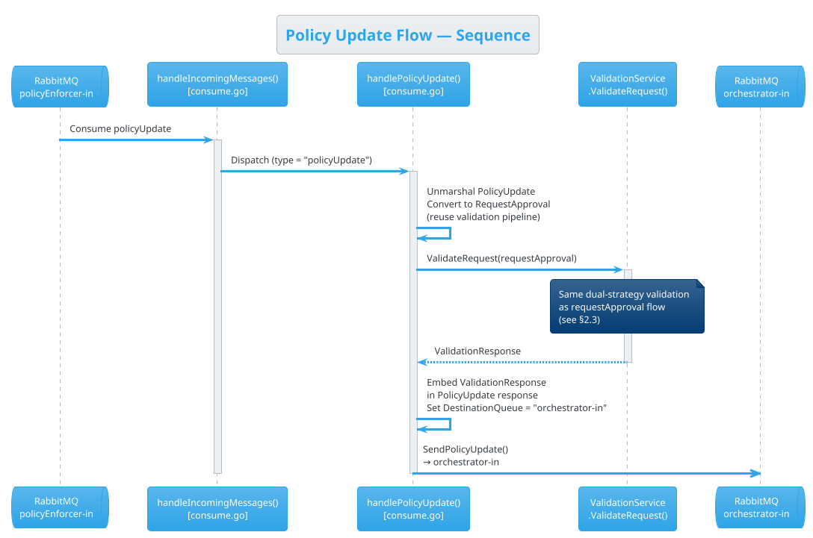
```plantuml
@startuml Sequence - Policy Update
!theme cerulean

title Policy Update Flow — Sequence

queue "RabbitMQ\npolicyEnforcer-in" as MQ_PE
participant "handleIncomingMessages()\n[consume.go]" as Router
participant "handlePolicyUpdate()\n[consume.go]" as HandlePU
participant "ValidationService\n.ValidateRequest()" as ValSvc
queue "RabbitMQ\norchestrator-in" as MQ_Orch

MQ_PE -> Router : Consume policyUpdate
activate Router

Router -> HandlePU : Dispatch (type = "policyUpdate")
activate HandlePU

HandlePU -> HandlePU : Unmarshal PolicyUpdate\nConvert to RequestApproval\n(reuse validation pipeline)

HandlePU -> ValSvc : ValidateRequest(requestApproval)
activate ValSvc

note over ValSvc
  Same dual-strategy validation
  as requestApproval flow
  (see §2.3)
end note

ValSvc --> HandlePU : ValidationResponse
deactivate ValSvc

HandlePU -> HandlePU : Embed ValidationResponse\nin PolicyUpdate response\nSet DestinationQueue = "orchestrator-in"

HandlePU ->> MQ_Orch : SendPolicyUpdate()\n→ orchestrator-in
deactivate HandlePU
deactivate Router

@enduml
```

---

## 3. Architecture Diagram

A static view of how the DYNAMOS components relate to each other, updated to
show the eFLINT subsystem within the Policy Enforcer.

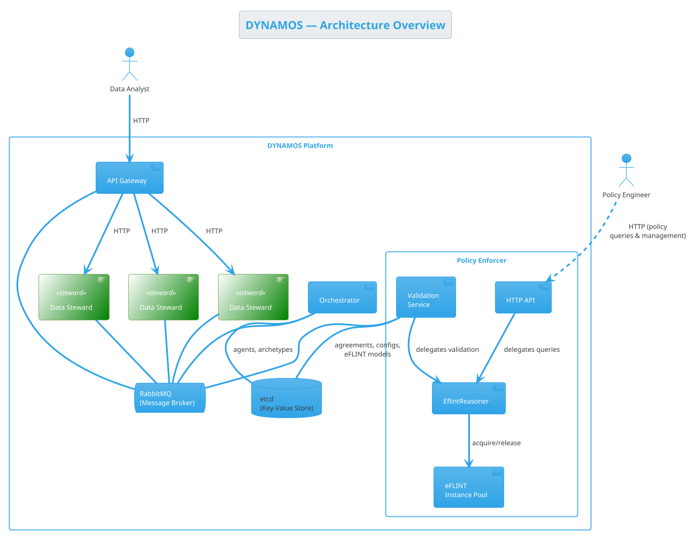
```plantuml
@startuml Architecture Diagram
!theme cerulean

title DYNAMOS — Architecture Overview

skinparam component {
    BackgroundColor<<steward>> #D5E8D4
    BorderColor<<steward>> #82B366
}

actor "Data Analyst" as analyst
actor "Policy Engineer" as engineer

rectangle "DYNAMOS Platform" {

    component "API Gateway" as api

    component "Orchestrator" as orch

    rectangle "Policy Enforcer" as pe_box {
        component "Validation\nService" as pe
        component "EflintReasoner" as reasoner
        component "eFLINT\nInstance Pool" as pool
        component "HTTP API" as pe_http
    }

    component "Data Steward" as ds3 <<steward>> #white/Green
    component "Data Steward" as ds2 <<steward>> #white/green
    component "Data Steward" as ds1 <<steward>> #white/Green

    database "etcd\n(Key-Value Store)" as etcd

    queue "RabbitMQ\n(Message Broker)" as rabbit
}

' External actors
analyst --> api : HTTP
engineer ..> pe_http : HTTP (policy\nqueries & management)

' Inter-service communication via RabbitMQ
api -- rabbit
pe -- rabbit
orch -- rabbit
ds1 -- rabbit
ds2 -- rabbit
ds3 -- rabbit

' etcd access
pe -- etcd : agreements, configs,\neFLINT models
orch -- etcd : agents, archetypes

' Internal PE connections
pe --> reasoner : delegates validation
pe_http --> reasoner : delegates queries
reasoner --> pool : acquire/release

' Direct HTTP from API Gateway to agents
api --> ds1 : HTTP
api --> ds2 : HTTP
api --> ds3 : HTTP

@enduml
```

---

## 4. Component Diagram

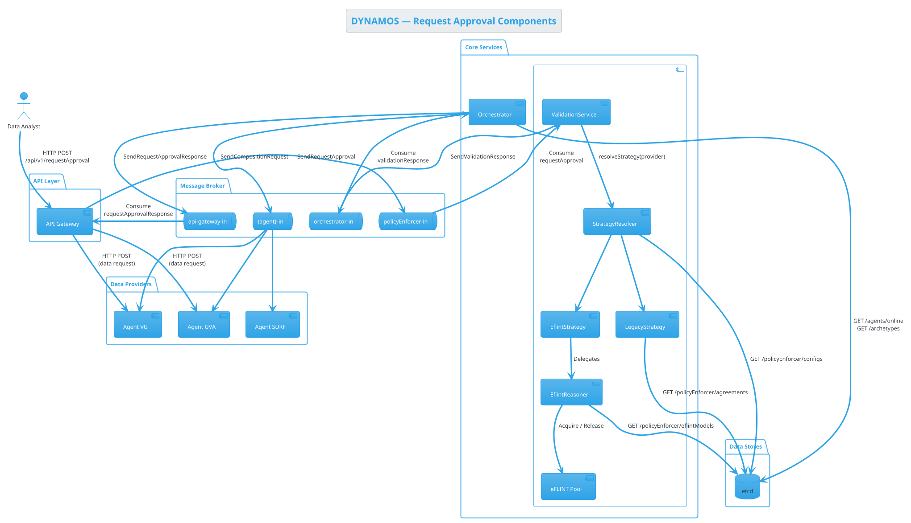
```plantuml
@startuml Request Approval Component Diagram
!theme cerulean

title DYNAMOS — Request Approval Components

actor "Data Analyst" as client

package "API Layer" {
    component "API Gateway" as api
}

package "Core Services" {
    component "Policy Enforcer" as pe {
        component "ValidationService" as val_svc
        component "StrategyResolver" as resolver
        component "LegacyStrategy" as legacy_strat
        component "EflintStrategy" as eflint_strat
        component "EflintReasoner" as eflint_reasoner
        component "eFLINT Pool" as pool
    }
    component "Orchestrator" as orch
}

package "Message Broker" {
    queue "policyEnforcer-in" as q_pe
    queue "orchestrator-in" as q_orch
    queue "api-gateway-in" as q_api
    queue "{agent}-in" as q_agent
}

package "Data Stores" {
    database "etcd" as etcd
}

package "Data Providers" {
    component "Agent VU" as agent_vu
    component "Agent UVA" as agent_uva
    component "Agent SURF" as agent_surf
}

' Client connections
client --> api : HTTP POST\n/api/v1/requestApproval

' API Gateway flows
api --> q_pe : SendRequestApproval
q_api --> api : Consume\nrequestApprovalResponse
api --> agent_vu : HTTP POST\n(data request)
api --> agent_uva : HTTP POST\n(data request)

' Policy Enforcer internal flows
q_pe --> val_svc : Consume\nrequestApproval
val_svc --> resolver : resolveStrategy(provider)
resolver --> etcd : GET /policyEnforcer/configs
resolver --> legacy_strat
resolver --> eflint_strat
legacy_strat --> etcd : GET /policyEnforcer/agreements
eflint_strat --> eflint_reasoner : Delegates
eflint_reasoner --> pool : Acquire / Release
eflint_reasoner --> etcd : GET /policyEnforcer/eflintModels
val_svc --> q_orch : SendValidationResponse

' Orchestrator flows
q_orch --> orch : Consume\nvalidationResponse
orch --> q_api : SendRequestApprovalResponse
orch --> q_agent : SendCompositionRequest
orch --> etcd : GET /agents/online\nGET /archetypes

' Agent queues
q_agent --> agent_vu
q_agent --> agent_uva
q_agent --> agent_surf

@enduml
```

---

## 5. Policy Enforcer — Internal Software Architecture

### 5.1 Strategy Pattern & Validation Pipeline

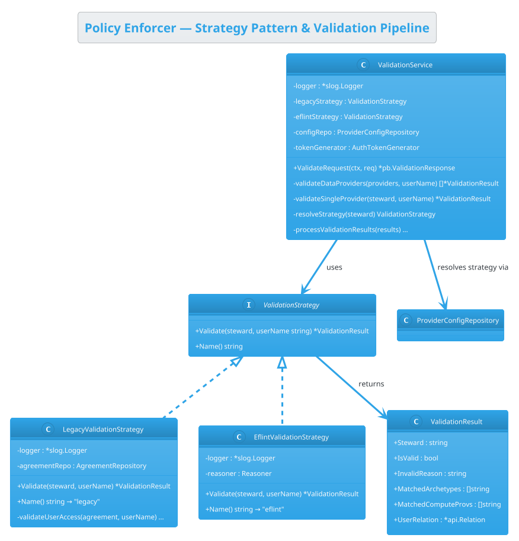
```plantuml
@startuml PE Software Architecture - Strategy Pattern
!theme cerulean

title Policy Enforcer — Strategy Pattern & Validation Pipeline

skinparam classAttributeIconSize 0

interface "ValidationStrategy" as VS {
    +Validate(steward, userName string) *ValidationResult
    +Name() string
}

class "ValidationService" as ValSvc {
    -logger : *slog.Logger
    -legacyStrategy : ValidationStrategy
    -eflintStrategy : ValidationStrategy
    -configRepo : ProviderConfigRepository
    -tokenGenerator : AuthTokenGenerator
    --
    +ValidateRequest(ctx, req) *pb.ValidationResponse
    -validateDataProviders(providers, userName) []*ValidationResult
    -validateSingleProvider(steward, userName) *ValidationResult
    -resolveStrategy(steward) ValidationStrategy
    -processValidationResults(results) ...
}

class "LegacyValidationStrategy" as LegacyStrat {
    -logger : *slog.Logger
    -agreementRepo : AgreementRepository
    --
    +Validate(steward, userName) *ValidationResult
    +Name() string → "legacy"
    -validateUserAccess(agreement, userName) ...
}

class "EflintValidationStrategy" as EflintStrat {
    -logger : *slog.Logger
    -reasoner : Reasoner
    --
    +Validate(steward, userName) *ValidationResult
    +Name() string → "eflint"
}

class "ValidationResult" as VR {
    +Steward : string
    +IsValid : bool
    +InvalidReason : string
    +MatchedArchetypes : []string
    +MatchedComputeProvs : []string
    +UserRelation : *api.Relation
}

ValSvc --> VS : uses
VS <|.. LegacyStrat
VS <|.. EflintStrat
VS --> VR : returns
ValSvc --> "ProviderConfigRepository" : resolves strategy via

@enduml
```

### 5.2 Reasoner Abstraction & HTTP API Layer

```plantuml
@startuml PE Software Architecture - Reasoner
!theme cerulean
allowmixing

title Policy Enforcer — Reasoner Abstraction & HTTP API Layer

skinparam classAttributeIconSize 0

interface "Reasoner" as R {
    +GetAllAllowedClauses(ctx, org, req) (*AllAllowedClauses, error)
    +IsRequestAllowed(ctx, params) (*RequestValidationResult, error)
    +IsRunning() bool
    +Name() string
}

class "EflintReasoner" as ER {
    -pool : *InstancePool
    -modelRepo : EflintModelRepository
    -logger : *slog.Logger
    --
    -withLoadedInstance(ctx, org, fn) error
    -filterAllowedClauses(facts, org, req) ...
}

class "Enforcer" as E {
    -reasoner : Reasoner
    -logger : *slog.Logger
    --
    +GetAllAllowedClauses(ctx, org, req) (*Response, error)
    +ValidateRequest(ctx, params) (*ValidationResponse, error)
    +IsRunning() bool
}

class "PolicyEnforcerHTTPHandler" as PEHH {
    -enforcer : *Enforcer
    --
    +GetAllAllowedClauses(w, r)
    +ValidateRequest(w, r)
}

class "InstancePool" as PoolRef {
    +Acquire() (*PoolEntry, error)
    +Release(entry *PoolEntry)
}

class "EflintModelRepository" as ModelRepoRef {
    +GetEflintModel(name) (string, bool, error)
}

PEHH --> E : delegates to
E --> R : delegates to
R <|.. ER : implements
ER --> PoolRef : acquires/releases instances
ER --> ModelRepoRef : loads models from etcd

@enduml
```

### 5.3 Repository Pattern

```plantuml
@startuml PE Software Architecture - Repositories
!theme cerulean
allowmixing

title Policy Enforcer — Repository Pattern

skinparam classAttributeIconSize 0

interface "AgreementRepository" as AR {
    +GetAgreement(steward) (*Agreement, bool, error)
}

interface "ProviderConfigRepository" as PCR {
    +GetProviderConfig(provider) (*ProviderValidationConfig, bool, error)
}

interface "EflintModelRepository" as EMR {
    +GetEflintModel(name) (string, bool, error)
}

interface "EflintStateRepository" as ESR {
    +GetEflintState(provider) (*EflintSavedState, bool, error)
    +SaveEflintState(provider, state) error
}

class "EtcdAgreementRepository" as EAR {
    -client : *etcd.Client
    -prefix : string
}

class "EtcdProviderConfigRepository" as EPCR {
    -client : *etcd.Client
    -prefix : string
}

class "EtcdEflintModelRepository" as EEMR {
    -client : *etcd.Client
    -prefix : string
}

class "EtcdEflintStateRepository" as EESR {
    -client : *etcd.Client
    -prefix : string
}

AR <|.. EAR
PCR <|.. EPCR
EMR <|.. EEMR
ESR <|.. EESR

database "etcd" as etcd

EAR --> etcd : /policyEnforcer/\nagreements/{steward}
EPCR --> etcd : /policyEnforcer/\nconfigs/{provider}
EEMR --> etcd : /policyEnforcer/\neflintModels/{name}
EESR --> etcd : /policyEnforcer/\neflint-states/{provider}

@enduml
```

### 5.4 eFLINT Instance Pool Architecture

```plantuml
@startuml PE Software Architecture - Pool
!theme cerulean

title Policy Enforcer — eFLINT Instance Pool Architecture

skinparam classAttributeIconSize 0

class "InstancePool" as IP {
    -available : chan *PoolEntry
    -registry : []*PoolEntry
    -targetSize : int32 (atomic)
    -config : PoolConfig
    --
    +Acquire() (*PoolEntry, error)
    +Release(entry *PoolEntry)
    +GetByID(id string) (*PoolEntry, error)
    +SetTargetSize(size int)
    +GetStatistics() PoolStatistics
    +Stop()
    -healthMonitor(ctx)
    -createInstance(id string) *PoolEntry
    -replaceInstance(entry *PoolEntry)
}

class "PoolEntry" as PE {
    +ID : string
    +Manager : *Manager
    +StateManager : *StateManager
    -state : string  // idle | in_use | unhealthy
    -mu : sync.RWMutex
    --
    +GetState() string
    +SetState(state string)
}

class "PoolConfig" as PC {
    +TargetSize : int
    +HealthCheckInterval : time.Duration
    +AcquireTimeout : time.Duration
    +ManagerConfig : ManagerConfig
}

class "PoolStatistics" as PS {
    +TargetSize : int
    +Total : int
    +Idle : int
    +InUse : int
    +Unhealthy : int
}

class "Manager" as Mgr {
    +Start(model) error
    +Stop() error
    +SendCommand(cmd) (string, error)
    +SendPhrases(text) (*PhrasesResponse, error)
}

class "StateManager" as SM {
    +Revert() error
    +VerifyEmptyState() error
    +ExportState() (*SavedState, error)
    +ImportState(state) error
    +CreateCheckpoint(name) error
    +RestoreCheckpoint(name) error
}

IP *-- "0..*" PE : registry
IP --> PC : configured by
IP --> PS : reports
PE --> Mgr : manages server via
PE --> SM : manages state via

@enduml
```

---

## 6. Deployment Diagram

```plantuml
@startuml Deployment Diagram
!theme cerulean

title DYNAMOS — Deployment Overview (Kubernetes)

node "Kubernetes Cluster" {

    node "Policy Enforcer Pod" as pe_pod {
        component "Policy Enforcer\nContainer" as pe_container {
            component "Validation Service" as val
            component "eFLINT Pool\n(3 instances)" as pool
            component "HTTP API\n(port 8080)" as http_api
        }
        component "Sidecar Container\n(gRPC → RabbitMQ)" as sidecar
        storage "eflint-states\n(emptyDir)" as states_vol
        storage "eflint-models\n(PVC: etcd-pvc)" as models_vol
    }

    node "API Gateway Pod" as api_pod {
        component "API Gateway" as api
        component "Sidecar" as api_sidecar
    }

    node "Orchestrator Pod" as orch_pod {
        component "Orchestrator" as orch
        component "Sidecar" as orch_sidecar
    }

    node "etcd Cluster\n(3 nodes)" as etcd

    node "RabbitMQ" as rabbit

    node "Agent Pods" as agent_pods {
        component "Agent VU" as vu
        component "Agent UVA" as uva
    }
}

actor "Data Analyst" as analyst

' External connections
analyst --> api : HTTP
analyst ..> http_api : HTTP (direct\nAPI queries)

' Internal connections
pe_container --> sidecar : gRPC\n(localhost:50051)
sidecar --> rabbit : AMQP
pe_container --> etcd : HTTP/gRPC

api --> api_sidecar : gRPC
api_sidecar --> rabbit : AMQP

orch --> orch_sidecar : gRPC
orch_sidecar --> rabbit : AMQP
orch --> etcd : HTTP/gRPC

api --> vu : HTTP
api --> uva : HTTP

' Volumes
pe_container --> states_vol
pe_container --> models_vol

' Ingress annotation
note right of http_api
  Ingress: policy-enforcer.
  orchestrator.svc.cluster.local
  /api/v1
end note

@enduml
```

---

## How to Render

These diagrams use standard [PlantUML](https://plantuml.com/) syntax. You can render them with:

- **VS Code** — install the *PlantUML* extension (`jebbs.plantuml`) and preview the fenced blocks.
- **CLI** — `java -jar plantuml.jar request_approval_diagrams.md` (PlantUML renders `plantuml` fenced blocks inside Markdown).
- **Online** — paste each block into [plantuml.com](https://www.plantuml.com/plantuml/uml).
