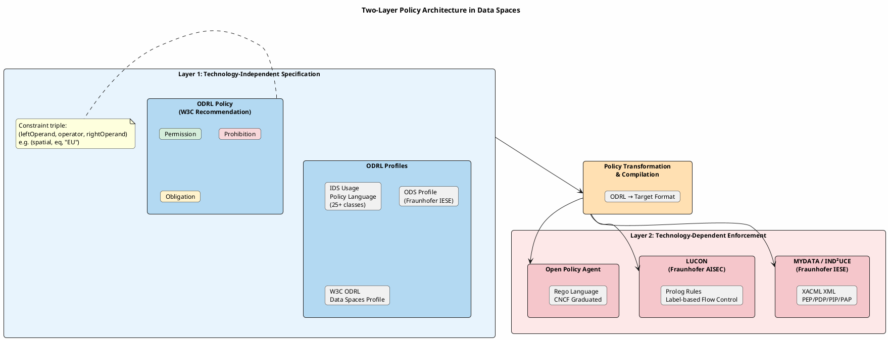
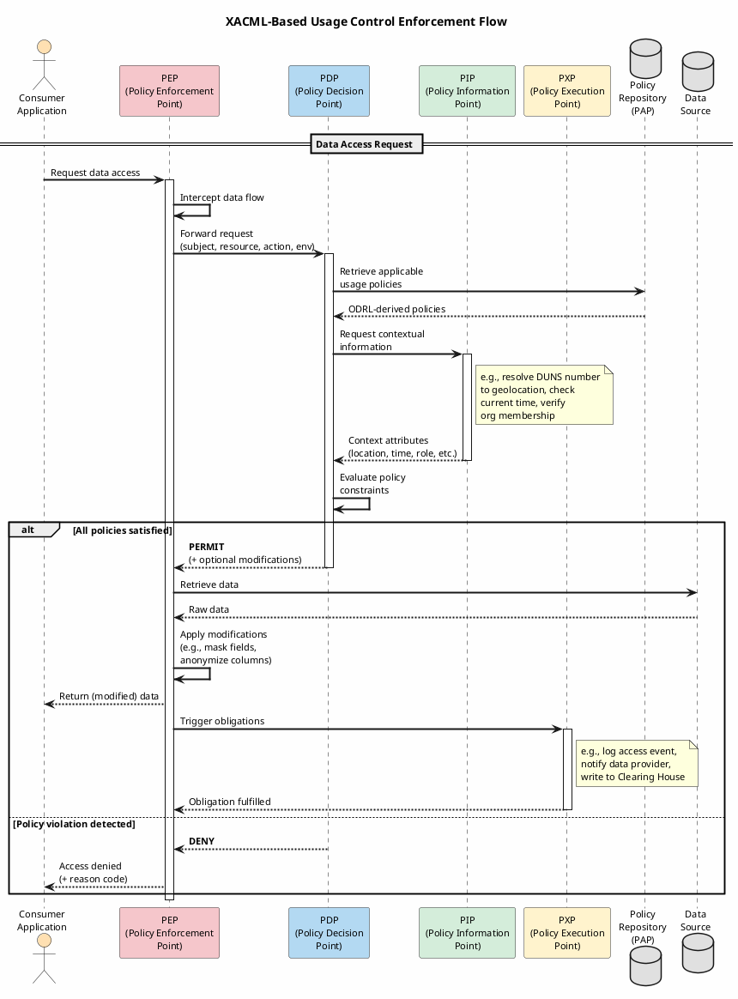
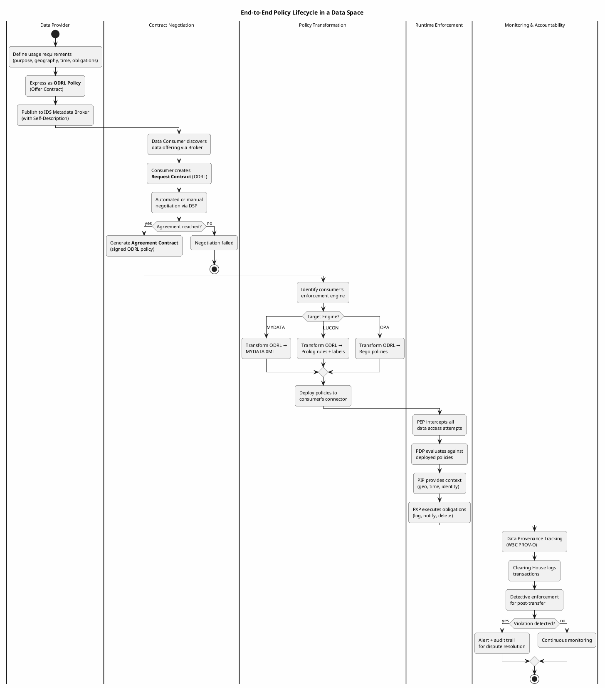
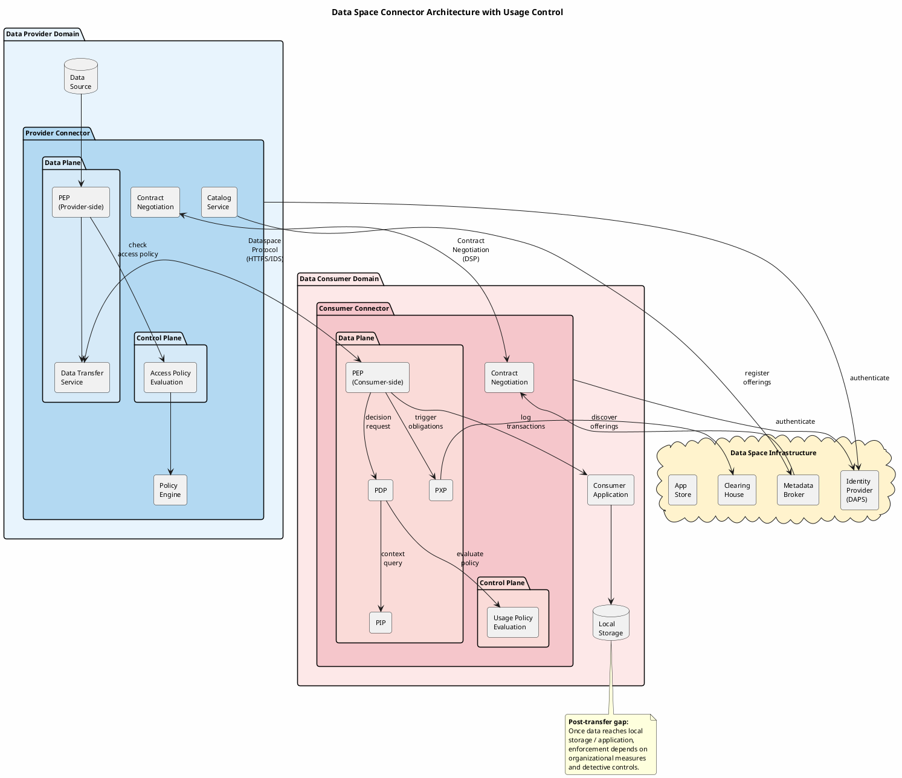
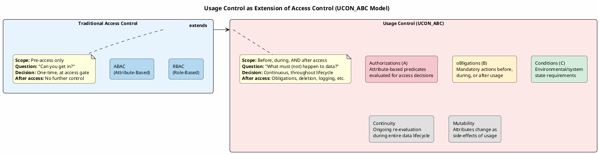

```plantuml
'=============================================================================
' DIAGRAM 1: Two-Layer Policy Architecture Overview
'=============================================================================

@startuml TwoLayerArchitectureOverview
title Two-Layer Policy Architecture in Data Spaces

skinparam backgroundColor #FEFEFE
skinparam packageStyle rectangle
skinparam defaultFontSize 12
skinparam shadowing false
skinparam roundcorner 10

package "Layer 1: Technology-Independent Specification" as L1 #E8F4FD {
    rectangle "ODRL Policy\n(W3C Recommendation)" as ODRL #B3D9F2 {
        card "Permission" as perm #D4EDDA
        card "Prohibition" as proh #F8D7DA
        card "Obligation" as obli #FFF3CD
    }

    note right of ODRL
        Constraint triple:
        (leftOperand, operator, rightOperand)
        e.g. (spatial, eq, "EU")
    end note

    rectangle "ODRL Profiles" as profiles #B3D9F2 {
        card "IDS Usage\nPolicy Language\n(25+ classes)" as ids_prof
        card "ODS Profile\n(Fraunhofer IESE)" as ods_prof
        card "W3C ODRL\nData Spaces Profile" as w3c_prof
    }
}

rectangle "Policy Transformation\n& Compilation" as transform #FFE0B2 {
    card "ODRL → Target Format" as t1
}

package "Layer 2: Technology-Dependent Enforcement" as L2 #FDE8E8 {
    rectangle "MYDATA / IND²UCE\n(Fraunhofer IESE)" as mydata #F5C6CB {
        card "XACML XML\nPEP/PDP/PIP/PAP" as mydata_fmt
    }
    rectangle "LUCON\n(Fraunhofer AISEC)" as lucon #F5C6CB {
        card "Prolog Rules\nLabel-based Flow Control" as lucon_fmt
    }
    rectangle "Open Policy Agent" as opa #F5C6CB {
        card "Rego Language\nCNCF Graduated" as opa_fmt
    }
}

ODRL -[hidden]-> profiles
L1 -down-> transform
transform -down-> mydata
transform -down-> lucon
transform -down-> opa

@enduml
```

```plantuml
'=============================================================================
' DIAGRAM 2: XACML Enforcement Flow (PEP/PDP/PIP/PXP)
'=============================================================================

@startuml XACMLEnforcementFlow
title XACML-Based Usage Control Enforcement Flow

skinparam backgroundColor #FEFEFE
skinparam sequenceArrowThickness 2
skinparam sequenceParticipantBorderColor #333333
skinparam defaultFontSize 11
skinparam shadowing false

actor "Consumer\nApplication" as App #FFE0B2
participant "PEP\n(Policy Enforcement\nPoint)" as PEP #F5C6CB
participant "PDP\n(Policy Decision\nPoint)" as PDP #B3D9F2
participant "PIP\n(Policy Information\nPoint)" as PIP #D4EDDA
participant "PXP\n(Policy Execution\nPoint)" as PXP #FFF3CD
database "Policy\nRepository\n(PAP)" as PAP #E0E0E0
database "Data\nSource" as Data #E0E0E0

== Data Access Request ==

App -> PEP : Request data access
activate PEP
PEP -> PEP : Intercept data flow

PEP -> PDP : Forward request\n(subject, resource, action, env)
activate PDP

PDP -> PAP : Retrieve applicable\nusage policies
PAP --> PDP : ODRL-derived policies

PDP -> PIP : Request contextual\ninformation
activate PIP
note right of PIP
    e.g., resolve DUNS number
    to geolocation, check
    current time, verify
    org membership
end note
PIP --> PDP : Context attributes\n(location, time, role, etc.)
deactivate PIP

PDP -> PDP : Evaluate policy\nconstraints

alt All policies satisfied
    PDP --> PEP : **PERMIT**\n(+ optional modifications)
    deactivate PDP

    PEP -> Data : Retrieve data
    Data --> PEP : Raw data

    PEP -> PEP : Apply modifications\n(e.g., mask fields,\nanonymize columns)

    PEP --> App : Return (modified) data

    PEP -> PXP : Trigger obligations
    activate PXP
    note right of PXP
        e.g., log access event,
        notify data provider,
        write to Clearing House
    end note
    PXP --> PEP : Obligation fulfilled
    deactivate PXP

else Policy violation detected
    PDP --> PEP : **DENY**
    PEP --> App : Access denied\n(+ reason code)
end

deactivate PEP

@enduml
```

```plantuml
'=============================================================================
' DIAGRAM 3: End-to-End Policy Lifecycle in a Data Space
'=============================================================================

@startuml PolicyLifecycle
title End-to-End Policy Lifecycle in a Data Space

skinparam backgroundColor #FEFEFE
skinparam activityBorderColor #333333
skinparam defaultFontSize 11
skinparam shadowing false
skinparam roundcorner 10

|Data Provider|
start
:Define usage requirements\n(purpose, geography, time, obligations);
:Express as **ODRL Policy**\n(Offer Contract);
:Publish to IDS Metadata Broker\n(with Self-Description);

|Contract Negotiation|
:Data Consumer discovers\ndata offering via Broker;
:Consumer creates\n**Request Contract** (ODRL);
:Automated or manual\nnegotiation via DSP;

if (Agreement reached?) then (yes)
    :Generate **Agreement Contract**\n(signed ODRL policy);
else (no)
    :Negotiation failed;
    stop
endif

|Policy Transformation|
:Identify consumer's\nenforcement engine;

switch (Target Engine?)
case (MYDATA)
    :Transform ODRL →\nMYDATA XML;
case (LUCON)
    :Transform ODRL →\nProlog rules + labels;
case (OPA)
    :Transform ODRL →\nRego policies;
endswitch

:Deploy policies to\nconsumer's connector;

|Runtime Enforcement|
:PEP intercepts all\ndata access attempts;
:PDP evaluates against\ndeployed policies;
:PIP provides context\n(geo, time, identity);
:PXP executes obligations\n(log, notify, delete);

|Monitoring & Accountability|
:Data Provenance Tracking\n(W3C PROV-O);
:Clearing House logs\ntransactions;
:Detective enforcement\nfor post-transfer;

if (Violation detected?) then (yes)
    :Alert + audit trail\nfor dispute resolution;
else (no)
    :Continuous monitoring;
endif

stop

@enduml
```

```plantuml
'=============================================================================
' DIAGRAM 4: Connector Architecture with Usage Control
'=============================================================================

@startuml ConnectorArchitecture
title Data Space Connector Architecture with Usage Control

skinparam backgroundColor #FEFEFE
skinparam componentStyle rectangle
skinparam defaultFontSize 11
skinparam shadowing false
skinparam roundcorner 8

package "Data Provider Domain" as provider #E8F4FD {
    database "Data\nSource" as provDB

    package "Provider Connector" as provConn #B3D9F2 {
        component "Catalog\nService" as provCat
        component "Contract\nNegotiation" as provNeg
        component "Policy\nEngine" as provPol

        package "Control Plane" as provCP #D6EAF8 {
            component "Access Policy\nEvaluation" as provAccess
        }

        package "Data Plane" as provDP #D6EAF8 {
            component "PEP\n(Provider-side)" as provPEP
            component "Data Transfer\nService" as provTransfer
        }
    }

    provDB --> provPEP
    provPEP --> provAccess : check\naccess policy
    provAccess --> provPol
    provPEP --> provTransfer
}

cloud "Data Space Infrastructure" as infra #FFF3CD {
    component "Metadata\nBroker" as broker
    component "Clearing\nHouse" as clearing
    component "Identity\nProvider\n(DAPS)" as daps
    component "App\nStore" as appstore
}

package "Data Consumer Domain" as consumer #FDE8E8 {
    package "Consumer Connector" as consConn #F5C6CB {
        component "Contract\nNegotiation" as consNeg

        package "Control Plane" as consCP #FADBD8 {
            component "Usage Policy\nEvaluation" as consUsage
        }

        package "Data Plane" as consDP #FADBD8 {
            component "PEP\n(Consumer-side)" as consPEP
            component "PDP" as consPDP
            component "PIP" as consPIP
            component "PXP" as consPXP
        }
    }

    component "Consumer\nApplication" as consApp
    database "Local\nStorage" as consDB

    consPEP --> consPDP : decision\nrequest
    consPDP --> consPIP : context\nquery
    consPDP --> consUsage : evaluate\npolicy
    consPEP --> consPXP : trigger\nobligations
    consPEP --> consApp
    consApp --> consDB
}

provTransfer <-right-> consPEP : Dataspace\nProtocol\n(HTTPS/IDS)

provNeg <--> consNeg : Contract\nNegotiation\n(DSP)

provCat --> broker : register\nofferings
broker --> consNeg : discover\nofferings

consPXP --> clearing : log\ntransactions
provConn --> daps : authenticate
consConn --> daps : authenticate

note bottom of consDB
    **Post-transfer gap:**
    Once data reaches local
    storage / application,
    enforcement depends on
    organizational measures
    and detective controls.
end note

@enduml
```

```plantuml
'=============================================================================
' DIAGRAM 5: Usage Control vs. Access Control (Conceptual)
'=============================================================================

@startuml UsageControlVsAccessControl
title Usage Control as Extension of Access Control (UCON_ABC Model)

skinparam backgroundColor #FEFEFE
skinparam defaultFontSize 11
skinparam shadowing false
skinparam roundcorner 10

rectangle "Traditional Access Control" as tac #E8F4FD {
    rectangle "RBAC\n(Role-Based)" as rbac #B3D9F2
    rectangle "ABAC\n(Attribute-Based)" as abac #B3D9F2

    note bottom of tac
        **Scope:** Pre-access only
        **Question:** "Can you get in?"
        **Decision:** One-time, at access gate
        **After access:** No further control
    end note
}

rectangle "Usage Control (UCON_ABC)" as uc #FDE8E8 {
    rectangle "Authorizations (A)\nAttribute-based predicates\nevaluated for access decisions" as authz #F5C6CB

    rectangle "oBligations (B)\nMandatory actions before,\nduring, or after usage" as oblig #FFF3CD

    rectangle "Conditions (C)\nEnvironmental/system\nstate requirements" as cond #D4EDDA

    rectangle "Continuity\nOngoing re-evaluation\nduring entire data lifecycle" as cont #E0E0E0

    rectangle "Mutability\nAttributes change as\nside-effects of usage" as mut #E0E0E0

    note bottom of uc
        **Scope:** Before, during, AND after access
        **Question:** "What must (not) happen to data?"
        **Decision:** Continuous, throughout lifecycle
        **After access:** Obligations, deletion, logging, etc.
    end note
}

tac -right-> uc : **extends**

@enduml
```